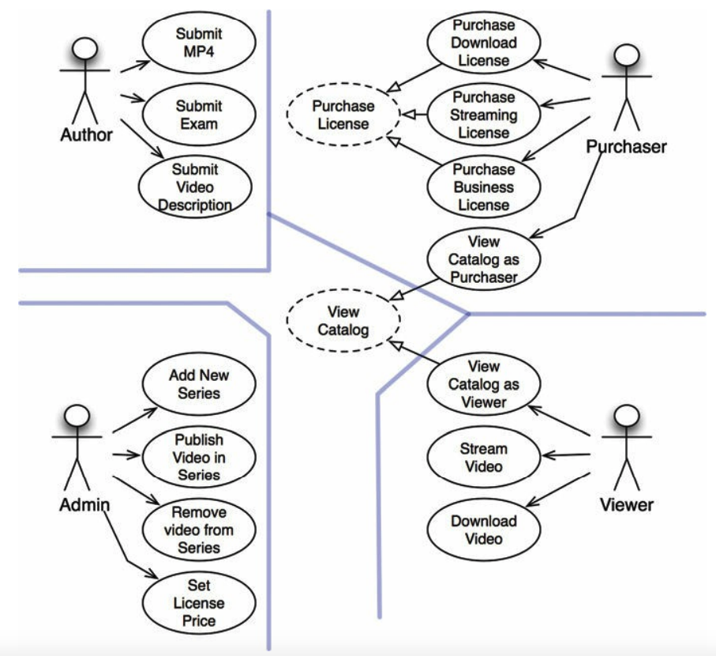
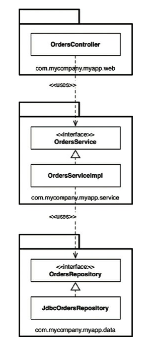
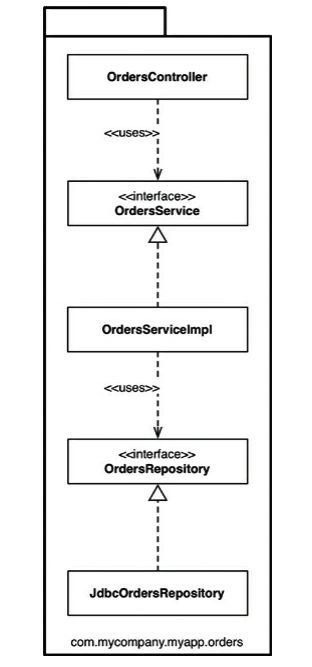
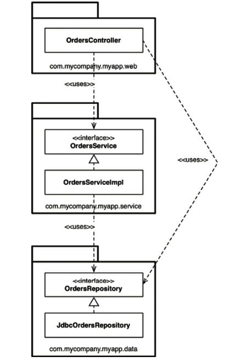
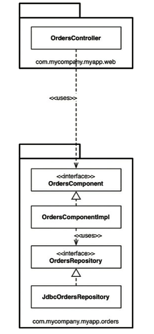
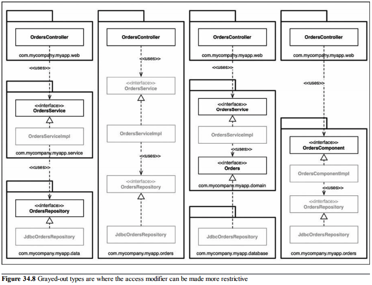
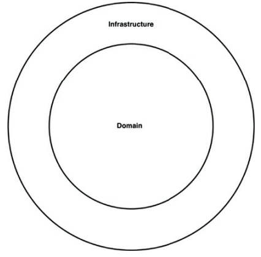

# Part 6 - Details

  * [The database is a detail](#the-database-is-a-detail)
    + [Relational databases](#relational-databases)
      - [Why are database systems so prevalent?](#why-are-database-systems-so-prevalent)
    + [What if there were no disk?](#what-if-there-were-no-disk)
    + [Details](#details)
      - [But what about performance?](#but-what-about-performance)
    + [Anecdote](#anecdote)
    + [Conclusion](#conclusion)
  * [The Web is a detail](#the-web-is-a-detail)
    + [The endless pendulum](#the-endless-pendulum)
    + [The Upshot](#the-upshot)
    + [Conclusion](#conclusion-1)
  * [Frameworks are details](#frameworks-are-details)
    + [Framework authors](#framework-authors)
    + [Asymmetric marriage](#asymmetric-marriage)
    + [The risks](#the-risks)
    + [The solution](#the-solution)
    + [I now pronounce you...](#i-now-pronounce-you)
    + [Conclusion](#conclusion-2)
  * [Case Study: Video Sales](#case-study-video-sales)
    + [The product](#the-product)
    + [Use case analysis](#use-case-analysis)
    + [Component architecture](#component-architecture)
    + [Dependency Management](#dependency-management)
    + [Conclusion](#conclusion-3)
  * [The Missing Chapter](#the-missing-chapter)
    + [Package by layer](#package-by-layer)
    + [Package by feature](#package-by-feature)
    + [Ports and adapters](#ports-and-adapters)
    + [Package by component](#package-by-component)
    + [The devil is in the implementation details](#the-devil-is-in-the-implementation-details)
    + [Organization vs. Encapsulation](#organization-vs-encapsulation)
    + [Other decoupling modes](#other-decoupling-modes)
    + [Conclusion](#conclusion-4)

## The database is a detail
From an architectural point of view, the database is a detail.
The data model is significant to the architecture, but the specific database being used to store it is a detail.

### Relational databases
In the 1970s, the relational model for storing data became popular for a good reason - it is elegant, disciplined and robust.

But no matter how brilliant it is, it is still a technology - a detail.

Relational tables might offer some convenience when retrieving/storing your data, but there isn't anything architecturally significant about arranging data into rows and tables.
The use cases of the system should not know anything about how the data is being stored.

#### Why are database systems so prevalent?
Because the main way to store data nowadays if via magnetic disks and storing data on magnetic disks is way slower than storing the data in memory.

Due to this limitation, some kind of data management system is needed in order to have some form of indexing, caching, optimized query schemes.
There are mainly two kinds of data management systems - file systems and RDBMS.

File systems are good at finding files based on their name/ID, but not good at searching for files based on contents.
RDBMS are good in searching through file contents, but not good at fetching the whole file.

Each of these has its use cases.

### What if there were no disk?
Disks used to be quite prevalent at the time, but they seem to be replaced by RAM nowadays - e.g. SSDs.

When the disks are gone, the databases we use today might become irrelevant.

### Details
In our software, we represent our data into data structures - lists, stacks, queues, etc.
In databases, we represent them as files/directories/tables/rows.

From an architectural point of view, it doesn't matter how the data structures are represented while residing in a database.

#### But what about performance?
Performance is an architectural concern, but in terms of fast read/write access, that can be addressed via the low-level data access mechanisms.
It shouldn't be an overall architectural concern.

### Anecdote
The author shares a story about working in a company which used random-access files for data storage as it made perfect sense for their use cases.

However, some marketing guy came and said they needed a RDBMS. The author fought that decision and eventually, the company did add an RDBMS.

The reason for that, was because the customers wanted a RDBMS even if they didn't need it.

What the author should have done, in that case, is to integrate an RDBMS via a low-level component so that they can easily replace it in the future once its realised it is not needed.

### Conclusion
The data model is architecturally significant. How that data model is being persisted is not.
The database is a detail.

## The Web is a detail
The author shares some stories of how the Web was thought to be a big think in the 1990s which changed everything.

It shouldn't have been a big deal. Our industry has seen multiple oscillations of such technologies which fundamentally moved the main horsepower between the server and the client.
Previously, it was thought the whole processing should be concentrated at the server. Nowadays, the clients tend to be more stuffed than the servers, etc etc.

### The endless pendulum
The oscillations between centralizing computer power and distributing will continue. It is a never ending cycle.

Those oscillations are short-term issues which should be encapsulated in our low-level components.
That way, we will be able to face them fearlessly as our projects mature.

At this point, the author shares a story about some personal finance software vendor, which originally had its application in a GUI.
But then, some marketing guy came and wanted it to be based in the Web. No one liked that among the customers, so they reverted back to having a GUI.

At that point, if the software architect had detached the UI from the business rules, they would have had (or did have) an easier time migrating between UIs based on the marketing department's fluctuations.

### The Upshot
The conclusion from all this is that the GUI is a detail, as well is the Web.

They are an IO device and we've learned long ago that we should write our software to be IO independent.
Hence, interactions with the UI should be encapsulated in low-level components.

However, the author also mentions that there are some specifics between the different UI mediums. The way a web applications interacts with a GUI is different from the way it interacts with the Web.

So, to some extent, the application is coupled to the specific UI being used.

However, the business rules and use cases can still be isolated from that. They can be assumed as some routines to which you pass some data and they return data back.

### Conclusion
This abstraction is not easy and it will take some time, but it is worth it and it is possible.

## Frameworks are details
There are many useful frameworks which have become quite popular as they are very useful.

However, frameworks are not architectures.

### Framework authors
Framework authors usually do their work for free which is admirable.

But they have their own best interests in mind, not yours as they don't know you.

Typically, frameworks are being made to serve the purposes of their authors' problems, not their users.
However, there is oftentimes an overlap between what the authors need and what their users need, which makes the frameworks popular.

### Asymmetric marriage
The relationship between users and framework authors is very asymmetrical.

Users marry the framework, but the authors don't marry the users.

This way, you take on all the risks and all the burdens. The authors take none.

### The risks
 * The architecture of the framework is often not very clean. Once your domain objects inherit from the framework objects, your whole application marries the framework.
 * The framework might help you with some early features of your application, but as it grows, it will probably outgrow the facilities of the framework
 * The framework might evolve in directions you don't find useful and helpful. You may even find old useful features disappearing.
 * A new and better framework might come along which you might want to switch to

### The solution
> Don't marry the framework!

Treat the framework as a detail that belongs to the outer circles of your architecture. Don't let it slip in the inner ones.

If the framework wants you to derive its base objects, don't do so. Derive proxies instead, which you keep in components that are plugins to your business rules.

For example, Spring is a good dependency injection framework. Don't use `@autowired` through your whole project.
Instead, isolate those usages in your main component.

### I now pronounce you...
There are some frameworks you simple must marry - the C++ STL framework, the standard libraries, etc.

That is normal, but it should be a decision. If you decide to marry a framework, you should know that you will be stuck with it forever.
Hence, only marry frameworks that you are certain will be stable dependencies.

### Conclusion
When faced with a framework, don't marry it right away. Consider putting the framework behind an architectural boundary.

Try to find a way to get the milk, without buying the cow.

## Case Study: Video Sales
This chapter puts all rules and practices covered in the book into an example use case - online video sales.

This case study depicts the process and decisions a good architect makes.

### The product
The case study is reminiscent of cleancoders.com, the author's website for selling his videos online.

It's stripped from all use cases the site has to support to keep the chapter short.

We have a batch of videos we want to sell.
They are sold to both individuals and businesses.

Individuals can pay one price to stream the videos and a higher price to download them and own them permanently.
Business licenses are streaming only.

Individuals act as both viewers and purchasers. Businesses often purchase for other people to view.

Video authors supply video files, descriptions, auxillary files with exams, problems, solutions, etc.

Administrators can add/delete videos, video series, establish prices for licenses.

The first step is to identify the actors and use cases.

### Use case analysis
Here's a typical use case analysis:

According to the SRP, these four actors will be the four primary sources of change for the system.

Every time some change to the system is to happen, it will be to serve one of these actors.
A change to one actor should not affect the rest of the actors.

Note that not all use cases were listed to keep the chapter simple.

### Component architecture
Now that the actors and use cases are known, an initial component architecture can be created:

Each of the categories are broken down by their corresponding actors.
Each of those components represents a potential `.jar` or `.dll` file.

Would the system really be broken down to all these jar files?
The author suggests that he will indeed break down the components into separate build artifacts, but the delivered artifacts don't need to necessarily adhere to this.
In the end, one could ship a single jar file, but with this architecture, you reserve the right to modify this behavior in the future.

### Dependency Management
Notice that the flow of control goes from right to left, but the dependencies mostly go from left to right.
This is in accordance to the dependency rule - lower-level components depend on higher-level ones.

### Conclusion
This architecture includes two dimensions of separation - one is based on actor, the other is based on the dependency rule.
The purpose of both is to separate components that change for different reasons and at different rates.

Different reason == change from actors. Different rates == change from technology.

## The Missing Chapter
This chapter focuses on covering the implementation details, which all previous chapters lack.

We are, again, using a case-study as our basis and we're building an online book store. 
We are asked to implement a feature that allows customers to view the status of their orders.

Let's put aside clean architecture for a moment and explore several ways to implement this.

### Package by layer
The first and simplest design approach is to use the traditional horizontal layered architecture.
In it, we separate the code based on what it does from a technical perspective.

Example implementation:

In this example, there is one layer for web code, one for business logic and one for the persistence.

Martin Fowler suggests that adopting such a partitioning is a good start and many share his view. 
The problem is that as your project grows, having only three distinct buckets of code is insufficient and you will have to modularize further.

Another problem is that layered architecture doesn't scream anything about the business domain. Put the code for two very different domains side by side and they will look very similar.

### Package by feature
An alternative is to adopt an approach where you are packaging your code based on the feature it implements - this is vertical slicing.

All the types/classes are placed in the same package, which is named to reflect the domain it serves:

This is simple refactoring from the package by layer design, but the top-level structure of the code now screams about the business domain.
This also makes making changes easier as all the code you need for a given feature is in the same package.

Both package by layer and package by feature are suboptimal, as this book has showcased.

### Ports and adapters
Ports and adapters, hexagonal architecture, etc.
All of them aim to create architectures where the business/domain-focused code is separate from the infrastructure.

The business rules are independent from the frameworks and databases being used.

Here's a high-level view of such an architecture:

The major rule is that the outside depends on the inside. Never the other way around.

Example implementation for our use case:

One caveat here is that the `OrdersRepository` has been renamed to `Orders`. This is an advice from domain-driven design.
Classes inside the business rules should have names specific to the domain. They shouldn't contain any technology-related terms.

Additionally, this diagram is simplified as it is missing some of the interactors and objects which deal with data marshal/unmarshal between boundaries.

### Package by component
In this section, the author of this chapter (who is not Uncle Bob) will present an alternative to clean architecture, which he finds more convenient and practical.
This approach is called package by component.

Layered architecture has already be condemned as bad, but there is an additional option the author considers it so.
It is easy to keep the dependency graph acyclic (in other words, correct) while violating the architectural boundaries by doing this:

The problem here, is that to prevent doing this, one has to either follow a strict coding review discipline or introduce some kind of CI step which verifies dependencies are not violated.
The problem with both approaches is that the feedback loop is too big. The author prefers having this enforced compile-time.

That's what "package by component" is trying to address. It's a hybrid approach where the business rules and persistence layers are bundled in the same component while keeping the UI separate.

Example:

This is a very similar structure to what you might end up with when using micro-services.

A key benefit of this approach is that when you want to change "orders", there's only one component which you have to change - the OrdersComponent.
Inside it, the separation of concerns is still maintained, but that is not visible to the consumer.

Well-defined components are a stepping stone to a micro-services architecture.

### The devil is in the implementation details
All these four approaches can be thought of as different architectural styles.

But if one messes up the implementation details, then your architecture doesn't matter.

For example, if you make all your classes public, then whatever architecture you choose merely aids code organization, but doesn't help encapsulate it at all.

### Organization vs. Encapsulation
If you make all your classes `public`, all your components are simply organizational mechanisms, rather than encapsulation mechanisms.

If you ignore the packages, because all classes are public, what architectural style you use makes no difference.

Here's how the packages should look like if encapsulation is applied properly:

### Other decoupling modes
In addition to access modifiers, different environments might have alternative ways to decouple source code dependencies.

For example, Java 9's modules system allows one to distinguish between public and published classes.

Another alternative is to decouple your components at the source code level by e.g. grouping components into separate jar/dll files.
Although this is idealistic, it is often impractical due to performance constraints.

Instead, a more practical approach is to separate your code into "domain" and "infrastructure":

This approach also works but we wary of the problem that components in the infrastructure layer might invoke other components in the same layer without going through the domain first.

### Conclusion
The best design choices could be destroyed in a flash if you don't consider the implementation details.

When choosing a design approach, think about time and budget constraints, the size of your team & its skill level.
Also, try to make the compiler help you in establishing the ideal design for your system.

The devil is in the implementation details.

