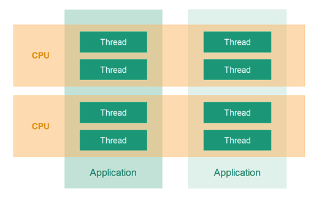

# Jenkov Concurrency Tutorial
> [Tutorial link](http://tutorials.jenkov.com/java-concurrency/index.html)

## Introduction
### What is Multithreading
Multithreading == multiple threads of execution inside a single program.
A multithreaded application is as if you have multiple CPUs executing your code at once.

However, threads != CPUs. Usually, a single CPU will share its execution time with multiple threads.


### Why Multithreading?
#### Better utilization of a single CPU
e.g. whilst one thread is waiting for input from a network, another one can run during this time.

#### Better utilization of multiple CPUs
If your computer has multiple CPUs then you'd need to use threads to fully utilize them.

#### Better UX in terms of responsiveness
A blocking operation (e.g. downloading a photo) in a UI should not cause the whole UI to stall. This can be achieved by having the UI be handled on a separate thread.

#### Better UX in terms of fairness
If one client's request takes too much time, the rest of the clients' requests should proceed.

### Multithreading vs. Multitasking
In the past, computers with a single CPU were able to execute only one program at a time.
This changed with the advent of multitasking.

#### Multitasking
Multitasking enables you to execute multiple programs at a time with a single CPU.
It was achieved by allowing programs to multiplex their CPU time - ie your foreground movie is running, but a background downloading program runs for a little from time to time.

#### Multithreading
Multithreading == multiple threads of execution inside the same program.
Multitasking == multiple programs running at the same time with the same CPU.

### Multithreading is hard
Multithreaded programs give rise to new kinds of errors not seen in single-threaded ones.
This stems from the fact that multiple threads are accessing the same shared memory, possibly, across different CPUs.

## Multithreading benefits
### Better CPU Utilization
Example sequential processing of files:
```
  5 seconds reading file A
  2 seconds processing file A
  5 seconds reading file B
  2 seconds processing file B
-----------------------
 14 seconds total
```

Example parallel processing of files (using the same CPU). Achieved by using the CPU for reading the second file while its idle:
```
  5 seconds reading file A
  5 seconds reading file B + 2 seconds processing file A
  2 seconds processing file B
-----------------------
 12 seconds total
```

### Simple Program Design
Sometimes, writing multithreaded code can result in simpler design as each processing unit is independent than the rest, hence, can be easier to read.

### More Responsive Programs
When multiple requests come to a server and the former requests take a long time to process, latter requests will have to wait regardless of processing time.

By using multithreading, one can achieve a much more responsive server.

Example without multithreading:
```
  while(server is active){
    listen for request
    process request
  }
```

Example with multithreading:
```
  while(server is active){
    listen for request
    hand request to worker thread
  }
```
