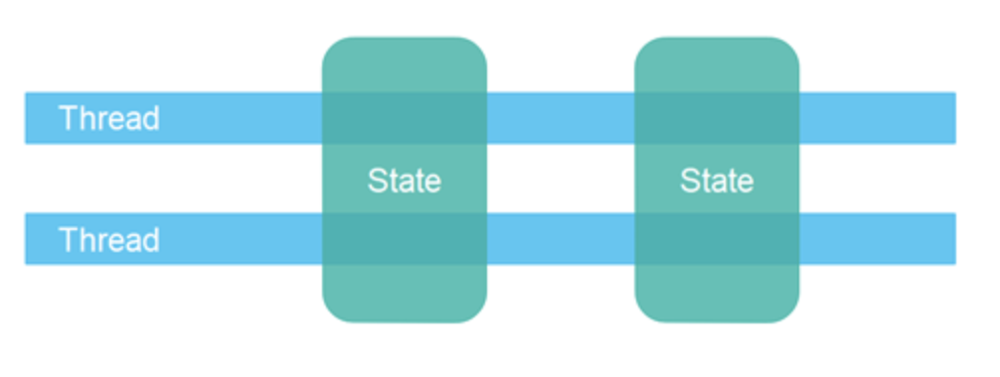
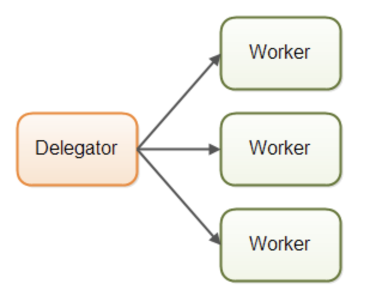
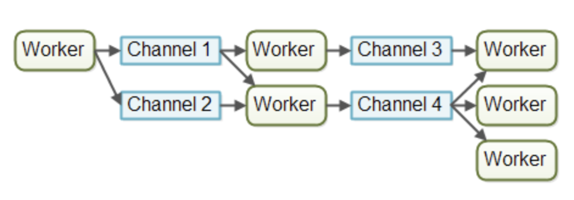

# Jenkov Concurrency Tutorial
> [Tutorial link](http://tutorials.jenkov.com/java-concurrency/index.html)

## Introduction
### What is Multithreading
Multithreading == multiple threads of execution inside a single program.
A multithreaded application is as if you have multiple CPUs executing your code at once.

However, threads != CPUs. Usually, a single CPU will share its execution time with multiple threads.


### Why Multithreading?
#### Better utilization of a single CPU
e.g. whilst one thread is waiting for input from a network, another one can run during this time.

#### Better utilization of multiple CPUs
If your computer has multiple CPUs then you'd need to use threads to fully utilize them.

#### Better UX in terms of responsiveness
A blocking operation (e.g. downloading a photo) in a UI should not cause the whole UI to stall. This can be achieved by having the UI be handled on a separate thread.

#### Better UX in terms of fairness
If one client's request takes too much time, the rest of the clients' requests should proceed.

### Multithreading vs. Multitasking
In the past, computers with a single CPU were able to execute only one program at a time.
This changed with the advent of multitasking.

#### Multitasking
Multitasking enables you to execute multiple programs at a time with a single CPU.
It was achieved by allowing programs to multiplex their CPU time - ie your foreground movie is running, but a background downloading program runs for a little from time to time.

#### Multithreading
Multithreading == multiple threads of execution inside the same program.
Multitasking == multiple programs running at the same time with the same CPU.

### Multithreading is hard
Multithreaded programs give rise to new kinds of errors not seen in single-threaded ones.
This stems from the fact that multiple threads are accessing the same shared memory, possibly, across different CPUs.

## Multithreading benefits
### Better CPU Utilization
Example sequential processing of files:
```
  5 seconds reading file A
  2 seconds processing file A
  5 seconds reading file B
  2 seconds processing file B
-----------------------
 14 seconds total
```

Example parallel processing of files (using the same CPU). Achieved by using the CPU for reading the second file while its idle:
```
  5 seconds reading file A
  5 seconds reading file B + 2 seconds processing file A
  2 seconds processing file B
-----------------------
 12 seconds total
```

### Simple Program Design
Sometimes, writing multithreaded code can result in simpler design as each processing unit is independent than the rest, hence, can be easier to read.

### More Responsive Programs
When multiple requests come to a server and the former requests take a long time to process, latter requests will have to wait regardless of processing time.

By using multithreading, one can achieve a much more responsive server.

Example without multithreading:
```
  while(server is active){
    listen for request
    process request
  }
```

Example with multithreading:
```
  while(server is active){
    listen for request
    hand request to worker thread
  }
```

## Multithreading Costs
To use multithreading in an application, the benefits gained should outweigh the costs.

Here are some of the costs of multithreading.
### More complex design
Some parts might be simpler by using multithreading, others though, might be more complex.

E.g. code involving shared data which needs to be synchronized.

### Context Switching Overhead
When a CPU needs to switch from executing one thread to another, there is some overhead incurred due to having to save the state of the thread in memory.

When you switch between threads too often, the time taken to switch threads might be more than the actual processing time.

### Increased Resource Consumption
A thread needs some resources in order to run. Hence, creating too much threads can consume a lot of memory/OS resources.

## Concurrency Models
Concurrency model == mechanism by which threads collaborate.

### Shared State vs Separate State
An important aspect of concurrency models is whether the state is shared or not.

Shared state -> can lead to race conditions and deadlocks.


Separate state -> threads use their own state which is shared via immutable objects or copies


### Parallel Workers


This is the most commonly used concurrency model in java application (implemented via the Executors framework).

Advantages - easy to understand & parallelize further
Disadvantages:
 * Uses shared state & it had all its disadvantages
 * Stateless workers - using shared state means that you need to re-read it every time you need it to avoid using a stale copy. This can be slow at times
 * Job ordering is nondeterministic - you can't guarantee the order of execution for the jobs

### Assembly Line (aka event-driven)


These systems are usually designed to use non-blocking IO and the non-blocking IO is the boundary between the workers.


Example implementation - in NodeJS with promises. Other implementations - Akka, Vert.x

Advantages:
 * No shared state - no need to worry about thread-safety
 * Stateful workers - since data is confined to workers, they can be stateful, ie keep their own data in-memory at all times
 * Better hardware conformity (aka mechanical sympathy) - single-threaded code plays nicer with hardware as you can use more optimized data structures and algorithms. You can also cache data.
 * Job ordering is possible - you can even log all events in a system & recreate the system's state from the logs later

Disadvantages:
 * May lead to complicated code
   * implementing callback hell
   * execution flow spread across several classes

### Actors vs. channels
Both use the "assembly line" concurrency model.

In the actor model, each worker is called an actor and they can send messages to one another.


In the channels model, each worker subscribes to messages on a channel which other workers can send messages to.


In the author's (and my) opinion, the channels model is more flexible as workers are decoupled from one another by leveraging channels.

### Functional Parallelism
Another popular concurrency model is functional parallelism.

Its idea is that a program execution can be broken down to the composition of individual functions 
which communicate by copying inputs/outputs (or using immutable objects) among them but never sharing them.

Function calls can be parallelized on multiple CPUs.

The caveat with this approach is knowing which functional calls to parallelize.
Some might be too small to be worth the hassle.

Example implementation is the java stream API.

### Which concurrency model is best?
If your tasks are naturally parallel & independent, the parallel workers concurrency model might be well suited for the job.
If the tasks need to share some state, the assembly line concurrency model fits better.

## Same-Threading
Concurrency model where a single-threaded system scales to N single-threaded systems.

### Why Single-threaded systems?
They are much simpler to deal with than multi-threaded systems due to the lack of shared state. Additionally, they can use non-thread safe data structures which utilize the CPU much more efficiently.

The downside is that a single-threaded system cannot fully utilize the CPU cores available on a machine:


### Same-threading == single-threading scaled out


Multi-threaded system == a lot of threads which share state.
Same-threaded system == a lot of threads not sharing any state.


### Thread Communication
If two threads in a same-threaded system need to communicate, they can achieve it by sending messages.
Messages are arbitrary byte sequences where the receiving thread get a copy of the original message.

The communication can take place via queues, pipes, unix sockets, TCP sockets, etc.

## Concurrency vs. Parallelism
Concurrency != Parallelism although they look very similar at first glance.

Concurrent execution == program is making progress on more than one task simultaneously. Doesn't necessarily need parallel execution:


Parallel execution == Program is making progress on more than one task in parallel.


Parallel concurrent execution == N tasks on M CPUs where N > M.


Parallelism == big task is split into subtasks which are executed concurrently and/or in parallel:


### Concurrency/Parallelism combos
 * Concurrent, not parallel - e.g. working on task #1 while task #2 is waiting for file IO
 * Parallel, not concurrent - e.g. program works on only one task which is split in subtasks & they are executed in parallel
 * Not concurrent, not parallel - e.g. traditional CLI applications
 * Concurrent, Parallel - e.g. web server handling multiple requests in parallel and some of them are multiplexed on the same CPU while waiting for database operation to complete.Q

## Single-threaded concurrency
Making progress on more than one task on a single thread.

### Still new ground
Popular libraries, technologies still use this concurrency model. Netty, Vert.x, Undertow and NodeJS use this model.

The model is centered around an event loop - a thread running in a loop, waiting for events in the system. When an event is invoked, your code, subscribed to the event gets executed.

### Classic multi-threaded concurrency
Typically assign one task per thread, but there are nuances, e.g. thread pools.

Advantages:
 * Relatively easy to distribute the work load across multiple threads

Disadvantages:
 * Hard to maintain & less performant when shared data gets involved.

### Single-threaded concurrency
You implement your task switching.

Benefits:
 * No thread visibility or race condition problems
 * control over task switching - you can decide how big of a chunk to work on before task switching
 * control over task prioritization

In the author's opinion, there are few benefits of this concurrency model over the classic multi-threaded approach. Javascript uses this model because it is a single-threaded language & it's the only option we've got.

### Challenges
 * Implementation required - you need to learn how to implement this model & actually implement it
 * Blocking operations have to be avoid or completed in background threads
 * Only uses a single CPU

### Single-threaded implementation - via thread loop
an infinite for loop is waiting for tasks to complete & completes them if any are present.
This thread can also be paused for several milliseconds if no work is estimated to come to avoid wasting CPU time in a tight loop.


Agent - a component which does some work & is invoked by the thread loop.
Thread loops invoke agents:


## Creating and starting Java threads
Thread == like a virtual CPU which executes your code

### Creating threads
```java
new Thread().start();
```

This example doesn't provide the thread any code to execute, therefore it will stop after it's started.

Ways to provide code for threads to execute:
 * Subclassing:
```java
  public class MyThread extends Thread {

    public void run(){
       System.out.println("MyThread running");
    }
  }
```

 * Via Runnable:
```java
  new Thread(() -> { System.out.println("Lambda Runnable running"); }).start();
```

Common pitfall, avoid invoking `run()` over `start()`. That method executes the runnable in the current thread, rather than the new one.

Specifying the name of the thread:
```java
Thread thread = new Thread("New Thread") {
  public void run(){
    System.out.println("run by: " + getName());
  }
};


thread.start();
System.out.println(thread.getName());
```

Getting the current thread object:
```java
Thread thread = Thread.currentThread();
```

To stop a thread, the implementation should allow it. Example:
```java
public class MyRunnable implements Runnable {

    private boolean doStop = false;

    public synchronized void doStop() {
        this.doStop = true;
    }

    private synchronized boolean keepRunning() {
        return this.doStop == false;
    }

    @Override
    public void run() {
        while(keepRunning()) {
            // keep doing what this thread should do.
            System.out.println("Running");

            try {
                Thread.sleep(3L * 1000L);
            } catch (InterruptedException e) {
                e.printStackTrace();
            }

        }
    }
}
```
