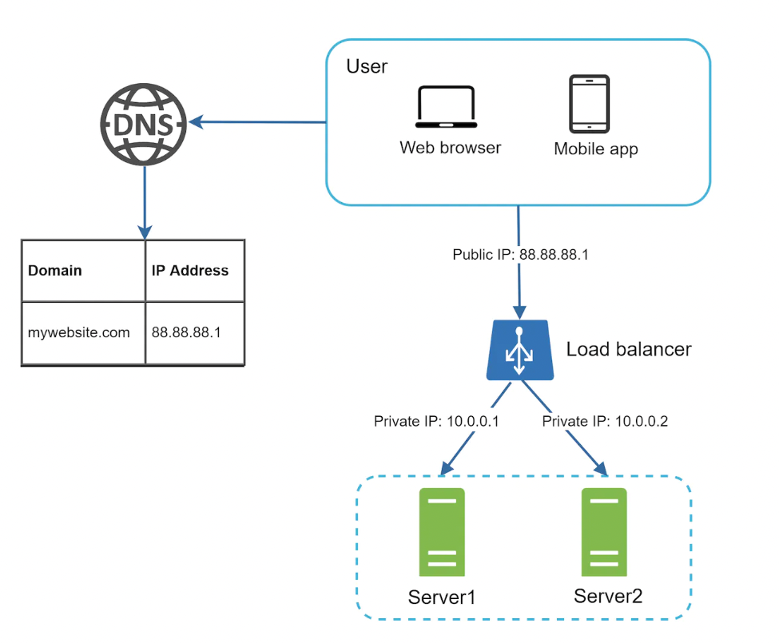
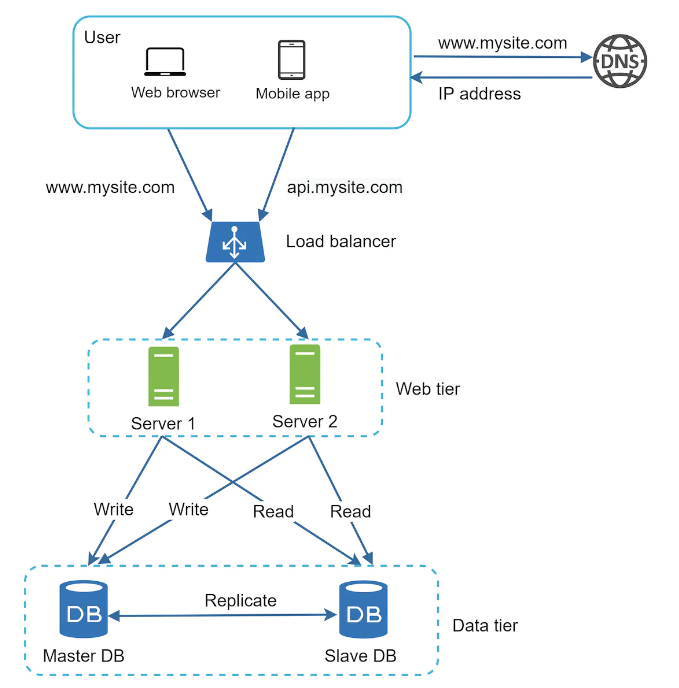

# Scale From Zero to Millions of Users
Here, we're building a system that supports a few users & gradually scale it to support millions.

# Single server setup
To start off, we're going to put everything on a single server - web app, database, cache, etc.


What's the request flow in there?
 * User asks DNS server for the IP of my site (ie `api.mysite.com -> 15.125.23.214`). Usually, DNS is provided by third-parties instead of hosting it yourself.
 * HTTP requests are sent directly to server (via its IP) from your device
 * Server returns HTML pages or JSON payloads, used for rendering.

Traffic to web server comes from either a web application or a mobile application:
 * Web applications use a combo of server-side languages (ie Java, Python) to handle business logic & storage. Client-side languages (ie HTML, JS) are used for presentation.
 * Mobile apps use the HTTP protocol for communication between mobile & the web server. JSON is used for formatting transmitted data. Example payload:
```
{
  "id":12,
  "firstName":"John",
  "lastName":"Smith",
  "address":{
     "streetAddress":"21 2nd Street",
     "city":"New York",
     "state":"NY",
     "postalCode":10021
  },
  "phoneNumbers":[
     "212 555-1234",
     "646 555-4567"
  ]
}
```

# Database
As the user base grows, storing everything on a single server is insufficient. 
We can separate our database on another server so that it can be scaled independently from the web tier:


## Which databases to use?
You can choose either a traditional relational database or a non-relational (NoSQL) one.
 * Most popular relational DBs - MySQL, Oracle, PostgreSQL.
 * Most popular NoSQL DBs - CouchDB, Neo4J, Cassandra, HBase, DynamoDB

Relational databases represent & store data in tables & rows. You can join different tables to represent aggregate objects.
NoSQL databases are grouped into four categories - key-value stores, graph stores, column stores & document stores. Join operations are generally not supported.

For most use-cases, relational databases are the best option as they've been around the most & have worked quite well historically.

If not suitable though, it might be worth exploring NoSQL databases. They might be a better option if:
 * Application requires super-low latency.
 * Data is unstructured or you don't need any relational data.
 * You only need to serialize/deserialize data (JSON, XML, YAML, etc).
 * You need to store a massive amount of data.

# Vertical scaling vs. horizontal scaling
Vertical scaling == scale up. This means adding more power to your servers - CPU, RAM, etc.

Horizontal scaling == scale out. Add more servers to your pool of resources.

Vertical scaling is great when traffic is low. Simplicity is its main advantage, but it has limitations:
 * It has a hard limit. Impossible to add unlimited CPU/RAM to a single server.
 * Lack of fail over and redundancy. If server goes down, whole app/website goes down with it.

Horizontal scaling is more appropriate for larger applications due to vertical scaling's limitations. Its main disadvantage is that it's harder to get right.

In design so far, the server going down (ie due to failure or overload) means the whole application goes down with it. 
A good solution for this problem is to use a load balancer.

# Load balancer
A load balancer evenly distributes incoming traffic among web servers in a load-balanced set:


Clients connect to the public IP of the load balancer. Web servers are unreachable by clients directly.
Instead, they have private IPs, which the load balancer has access to.

By adding a load balancer, we successfully made our web tier more available and we also added possibility for fail over.

How it works?
 * If server 1 goes down, all traffic will be routed to server 2. This prevents website from going offline. We'll also add a fresh new server to balance the load.
 * If website traffic spikes and two servers are not sufficient to handle traffic, load balancer can handle this gracefully by adding more servers to the pool.

Web tier looks lit now. But what about the data tier?

# Database replication
Database replication can usually be achieved via master/slave replication (side note - nowadays, it's usually referred to as primary/secondary replication).

A master database generally only supports writes. Slave databases store copies of the data from the master & only support read operations.
This setup works well for most applications as there's usually a higher write to read ratio. Reads can easily be scaled by adding more slave instances.


Advantages:
 * Better performance - enables more read queries to be processed in parallel.
 * Reliability - If one database gets destroyed, data is still preserved.
 * High availability - Data is accessible as long as one instance is not offline.

So what if one database goes offline?
 * If slave database goes offline, read operations are routed to the master/other slaves temporarily. 
 * If master goes down, a slave instance will be promoted to the new master. A new slave instance will replace the old master.


Here's the refined request lifecycle:
 * user gets IP address of load balancer from DNS
 * user connects to load balancer via IP
 * HTTP request is routed to server 1 or server 2
 * web server reads user data from a slave database instance or routes data modifications to the master instance.

Sweet, let's now improve the load/response time by adding a cache & shifting static content to a CDN.

# Cache
TODO
