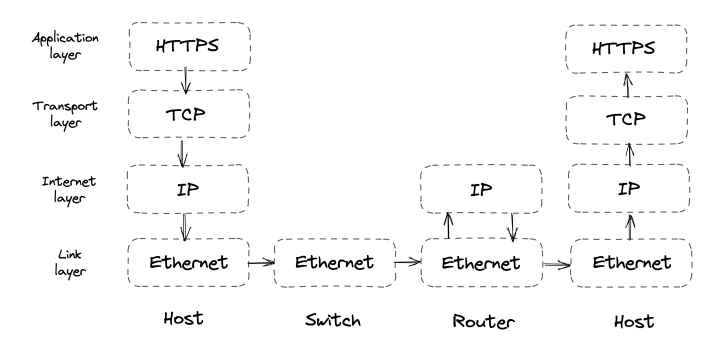

# Communication

## Introduction
In order for processes to communicate, they need to agree on a set of rules which determine how data is transmitted and processed. Network protocols define these rules.

Network protocols are arranged in a stack - every protocol piggybacks on the abstraction provided by the protocol underneath.

Taking a closer look:
 * The link layer provides an interface for operating on the underlying network hardware via eg the Ethernet protocol.
 * The internet layer provides an interface for sending data from one machine to another with a best-effort guarantee - ie data can be lost, corrupted, etc.
 * The transport layer enables transmitting data between processes (different from machines, because you might have N processes on 1 machine). Most important protocol at this layer is TCP - it adds reliability to the IP protocol.
 * The application layer is a high-level protocol, targetted by applications - eg HTTP, DNS, etc.

## Reliable links
Communication between nodes happens by transmitting packages between them. This requires 1) addressing nodes and 2) a mechanism for routing packets across routers.

Addressing is handled by the IP protocol. Routing is handled within the routers' routing tables. Those create a mapping between destination address and the next router along the path.
The responsibility of building & communicating the routing tables is handled by the Border Gateway Protocol (BGP).

IP, however, doesn't guarantee that data sent over the internet will arrive at the destination. TCP, which lies in the transport layer, handles this.
It provides a reliable communication channel on top of an unreliable one (IP). A stream of bytes arrives at the destination without gaps, duplication or corruption.
This protocol also has backoff mechanisms in-place to avoid congesting the transportation network, making it a healthy protocol for the internet.

### Reliability
Achieved by:
 * splitting a stream of bytes into discrete segments, which have sequence numbers and a checksum.
 * Due to this, the receiver can detect holes, duplicates and corrupt segments (due to the checksum).
 * Every segment needs to be acknowledged by the receiver, otherwise, they are re-transmitted.

### Connection lifecycle
With TCP, a connection must be established first. The OS manages the connection state on both sides via sockets.

To establish a connection, TCP uses a three-way-handshake:

The numbers exchanged are the starting sequence numbers for upcoming data packets on both sides of the connection.

This connection setup step is an overhead in starting the communication. It is mainly driven by the round-trip time. To make it fast, put servers as close as possible to clients.
There is also some tear down time spent when closing a connection.

Finally, once a connection is closed, the socket is not released immediately. It has some teardown time as well.
Due to this, constantly opening and closing connections can quickly drain your available sockets.

This is typically mitigated by:
 * Leveraging connection pools
 * Not closing a TCP connection between subsequent request/response pairs

### Flow Control
Flow control is a back-off mechanism which TCP implements to prevent the sender from overflowing the receiver.

Received segments are stored in a buffer, while waiting for the process to read them:

The receive buffer size is also communicated back to the sender, who uses it to determine when to back-off:

This mechanism is similar to rate limiting, but at the connection level.

### Congestion control
TCP protects not only the receiver, but the underlying network as well.

An option called `congestion window` is used, which specifies the total number of packets which can be in-flight (sent but not ack).

The smaller the congestion window, the less bandwidth is utilized.

When a connection starts, the congestion window is first set to a system default and it slowly adjusts based on the feedback from the underlying network:

Timeouts & missed packets adjusts the congestion window down. Successful transmissions adjust it up.

Effectively, slower round trip times yield larger bandwidths. Hence, favor placing servers close to clients.

### Custom Protocols
TCP delivers reliability and stability at the expense of extra latency and reduced bandwidth.

UDP is an alternative protocol, which doesn't provide TCP's reliability mechanisms. It is used as a canvas for custom protocols to be built on-top which have some of TCP's functionalities but not all.

Games are one example where using TCP is an overhead. 
If a client misses a single game frame sent from the server, TCP would attempt to retransmit it. 

However, for games that is unnecessary because the game state would have already progressed once the packet gets retransmitted.
