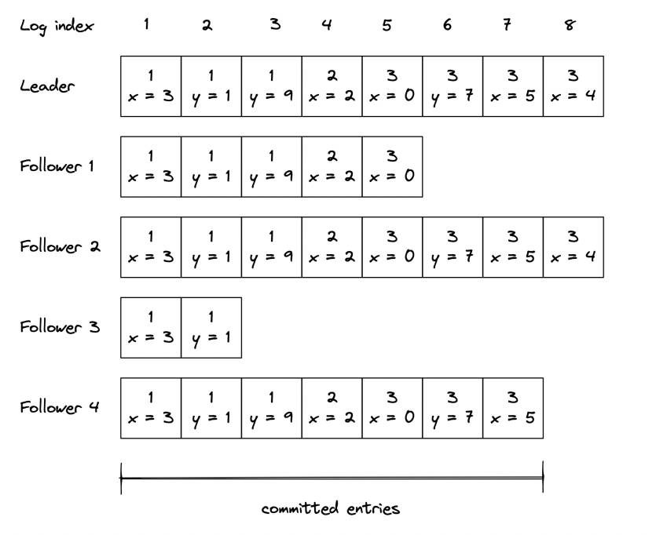
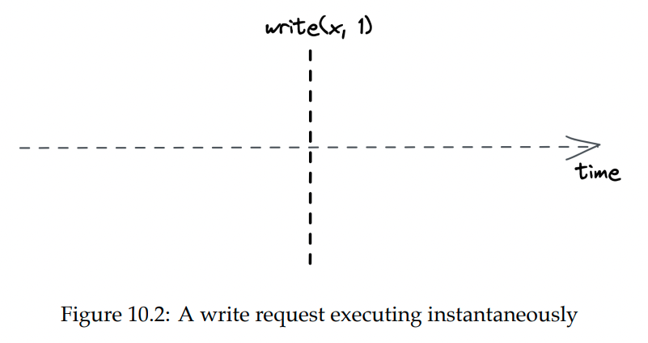
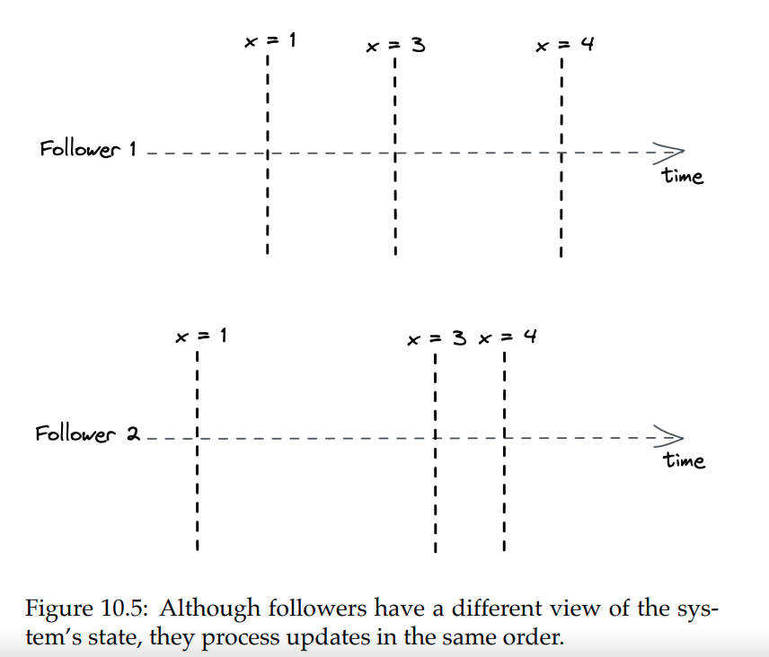
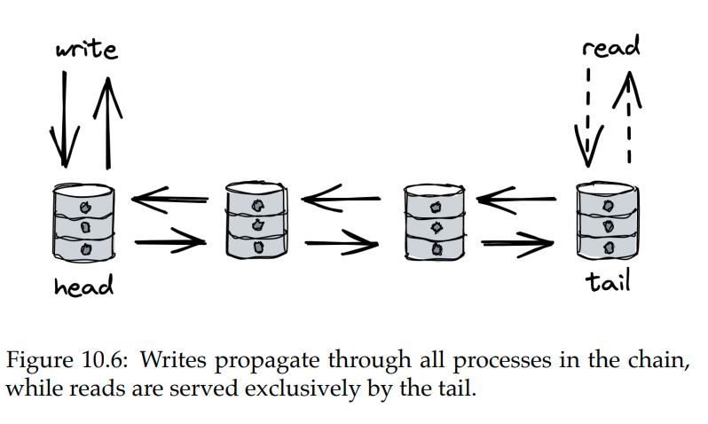
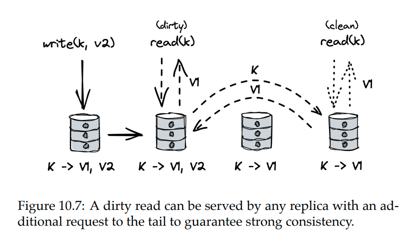

# Coordination

So far, focus is on making nodes communicate. Focus now is to make nodes coordinate as if they're a single coherent system.

## System Models
To reason about distributed systems, we must strictly define what can and cannot happen.

A system model is a set of assumptions about the behavior of processes, communication links and timing while abstracting away the complexities of the technology being used.

Some common models for communication links:
 * fair-loss link - messages may be lost and duplicated, but if sender keeps retransmitting messages, they will eventually be delivered.
 * reliable link - messages are delivered exactly once without loss or duplication. Reliable links can be implemented on top of fair-loss links by deduplicating messages at receiving end.
 * authenticated reliable link - same as reliable link but also assumes the receiver can authenticate the sender.

Although these models are abstractions of real communication links, they are useful to verify the correctness of algorithms.

We can also model process behavior based on the types of failures we can expect:
 * arbitrary-fault model - aka "Byzantine" model, the process can deviate from algorithm in unexpected ways, leading to crashes due to bugs or malicious activity.
 * crash-recovery model - process doesn't deviate from algorithm, but can crash and restart at any time, losing its in-memory state.
 * crash-stop model - process doesn't deviate from algorithm, it can crash and when it does, it doesn't come back online. Used to model unrecoverable hardware faults.

The arbitrary-fault model is used to describe systems which are safety-criticla or not in full control of all the processes - airplanes, nuclear power plants, the bitcoin digital currency.

This model is out of scope for the book. Algorithms presented mainly focus on the crash-recovery model.

Finally, we can model timing assumptions:
 * synchronous model - sending a message or executing an operation never takes more than a certain amount of time. Not realistic for the kinds of systems we're interested in.
    * Sending messages over the network can take an indefinite amount of time. Processes can also be slowed down by garbage collection cycles.
 * asynchronous model - sending a message or executing an operation can take an indefinite amount of time.
 * partially synchronous model - system behaves synchronously most of the time. Typically representative enough of real-world systems.

Throughout the book, we'll assume a system model with fair-loss links, crash-recovery processes and partial synchrony.

## Failure Detection
When a client sends a request to a server & doesn't get a reply back, what's wrong with the server?

One can't tell, it might be:
 * server is very slow
 * it crashed
 * there's a network issue

Worst case, client will wait forever until they get a response back. Possible mitigation is to setup timeout, back-off and retry.

However, a client need not wait until they have to send a message to figure out that the server is down. They can maintain a list of available processes which they ping or heartbeat to figure out if they're alive:
 * ping - periodic request from client to server to check if process is available.
 * heartbeat - periodic request from server to client to indicate that server is still alive.

Pings and heartbeats are used in situations where processes communicate with each other frequently, eg within a microservice deployment.

## Time
Time is critical in distributed systems:
 * On the network layer for DNS TTL records
 * For failure detection via timeouts
 * For determining ordering of events in a distributed system
 
The last use-case is one we're to tackle in the chapter. 

The challenge with that is that in distributed systems, there is no single global clock all services agree on unlike a single-threaded application where events happen sequentially.

We'll be exploring a family of clocks which work out the order of operations in a distributed system.

### Physical Clocks
Processes have access to a physical wall-time clock. Every machine has one. The most common one is based on a vibrating quartz crystal, which is cheap but not insanely accurate.

Because quartz clocks are not accurate, they need to be occasionally synced with servers with high-accuracy clocks.

These kinds of servers are equipped with atomic clocks, which are based on quantum mechanics. They are accurate up to 1s in 3 mil years.

Most common protocol for time synchronization is the Network Time Protocol (NTP).

Clients synchronize their clock via this protocol, which also factors in the network latency. The problem with this approach is that the clock can go back in time on the origin machine.

This can lead to a situation where operation A which happens after operation B has a smaller timestamp.

An alternative is to use a clock, provided by most OS-es - monotonic clock. It's a forward-only moving clock which measures time elapsed since a given event (eg boot up).

This is useful for measuring time elapsed between timestamps on the same machine, but not for timestamps across multiple ones.

### Logical Clocks
Logical clocks measure passing of time in terms of logical operations, not wall-clock time.

Example - counter, incremented on each operation. This works fine on single machines, but what if there are multiple machines.

A Lamport clock is an enhanced version where each message sent across machines includes the logical clock's counter. Receiving machines take into consideration the counter of the message they receive.

Subsequent operations are timestamped with a counter bigger than the one they received.

With this approach, dependent operations will have different timestamps, but unrelated ones can have identical ones.

To break ties, the process ID can be included as a second ordering factor.

Regardless of this, logical clocks don't imply a causal relationship. It is possible for event A to happen before B even if B's timestamp is greater.

### Vector Clocks
Vector clocks are logical clocks with the additional property of guaranteeing that event A happened before event B if A's timestamp is smaller than B.

Vector clocks have an array of counters, one for each process in the system:
 * Counters start from 0
 * When an operation occurs, the process increments its process' counter by 1
 * Sending a message increments the process' counter by 1. The array is included in the message
 * Receiving process merges the received array with its local one by taking the max for each element.
   * Finally, its process counter is incremented by 1 

This guarantees that event A happened before B if:
 * Every counter in A is `less than or equal` every counter in B
 * At least one counter in A is `less than` corresponding counter in B 

If neither A happened before B nor B happened before A, the operations are considered concurrent

In the above example:
 * B happened before C
 * E and C are concurrent

A downside of vector clocks is that storage requirements grow with every new process.
Other types of logical clocks, like [dotted version clocks](https://queue.acm.org/detail.cfm?id=2917756) solve this issue.

### Summary
Using physical clocks for timestamp is good enough for some records such as logs.

However, when you need to derive the order of events across different processes, you'll need vector clocks.

## Leader Election
There are use-cases where 1 among N processes needs to gain exclusive rights to accessing a shared resource or to assign work to others.

To achieve this, one needs to implement a leader-election algorithm - to elect a single process to be a leader among a group of equally valid candidates.

There are two properties this algorithm needs to sustain:
 * Safety - there will always be one leader elected at a time.
 * Liveness - the process will work correctly even in the presence of failures.

This chapter explores a particular leader-election algorithm - Raft, and how it guarantees these properties.

### Raft leader election
Every process is a state machine with one of three states:
 * follower state - process recognizes another process as a leader
 * candidate state - process starts a new election, proposing itself as a leader
 * leader state - process is the leader

Time is divided into election terms, numbered with consecutive integers (logical timestamp).
A term begins with a new election - one or more candidates attempt to become the leader.

When system starts up, processes begin their journey as followers. 
As a follower, the process expects a periodic heartbeat from the leader.
If one does not arrive, a timeout begins ticking after which the process starts a new election & transitions into the candidate state.

In the candidate state, the process sends a request to all other notes, asking them to vote for them as the new leader.

State transition happens when:
 * Candidate wins the election - majority of processes vote for process, hence it wins the election.
 * Another process wins - when a leader heartbeat is received \w election term index `greater than or equal` to current one.
 * No one wins election - due to split vote. Then, after a random timeout (to avoid consecutive split votes), a new election starts.

### Practical considerations
There are also other leader election algorithms but Raft is simple & widely used.

In practice, you would rarely implement leader election from scratch, unless you're aiming to avoid external dependencies.

Instead, you can use any fault-tolerant key-value store \w support for TTL and linearizable CAS (compare-and-swap) operations.
This means, in a nutshell, that operations are atomic & there is no possibility for race conditions.

However, there is a possibility for race conditions after you acquire the lease.

It is possible that there is some network issue during which you lose the lease but you still think you're the leader.
This has [lead to big outages in the past](https://ravendb.net/articles/avoid-rolling-your-own-leader-election-algorithm)

As a rule of thumb, leaders should do as little work as possible & we should be prepared to occasionally have more than one leaders.

## Replication
Data replication is fundamental for distributed systems.

One reason for doing that is to increase availability. If data is stored on a single process and it goes down, the data is no longer available.

Another reason is to scale - the more replicas there are, the more clients can be supported concurrently.

The challenge of replication is to keep them consistent with one another in the event of failure.
The chapter will explore Raft's replication algorithm which provides the strongest consistency guarantee - to clients, the data appears to be stored on a single process.

Paxos is a more popular protocol but we're exploring Raft as it's simpler to understand.

Raft is based on state machine replication - leader emits events for state changes & all followers update their state when the event is received.

As long as the followers execute the same sequence of operations as the leader, they will end up with the same state.

Unfortunately, just broadcasting the event is not sufficient in the event of failures, eg network outages.

Example state-machine replication with a distributed key-value store:
 * KV store accepts operations put(k, v) and get(k)
 * State is stored in a dictionary

If every node executes the same sequence of puts, the state is consistent across all of them.

### State machine replication
When system starts up, leader is elected using Raft's leader election algorithm, which was already discussed.

State changes are persisted in an event log which is replicated to followers.

**Note:** The number in the boxes above the operation is the leader election term.

The replication algorithm works as follows:
 * Only the leader can accept state updates
 * When it accepts an update, it is persisted in the local log, but the state is not changed
 * The leader then sends an `AppendEntries` request to all followers \w the new entry. This is also periodically sent for the purposes of heartbeat.
 * When a follower receives the event, it appends it to its local log, but not its state. It then sends an acknowledge message back to leader.
 * Once leader receives enough confirmations to form a quorum (>50% acks from nodes), the state change is persisted to local state.
 * Followers also persist the state change on a subsequent `AppendEntries` request which indicates that the state is changed.

Such a system can tolerate F failures where total nodes = 2F + 1.

What if a failure happens?

If the leader dies, an election occurs. However, what if a follower with less up-to-date log becomes a leader? To avoid this, a node can't vote for another candidate if the candidate's log is less up-to-date.

What if a follower dies & comes back alive afterwards?
 * They will update their log after receiving an `AppendEntries` message from leader. That message also contains the index of the second to last log.
 * If the record is already present in the log, the follower ignores the message.
 * If the record is not present but the second to last log entry is, the new entry is appended.
 * If neither are present, the message is rejected.
 * When the message is rejected, the leader sends the last two messages. If those are also rejected, the last three are sent and so forth.
 * Eventually, the follower will receive all log entries they've missed and make their state up-to-date.

### Consensus
Solving state machine replication lead us to discover a solution to an important distributed systems problem - achieving consensus among a group of nodes.

Consensus definition:
 * every non-faulty process eventually agrees on a value
 * the final decision of non-faulty processes is the same everywhere
 * the value that has been agreed on has been proposed by a process

Consensus use-case example - agreeing on which process in a group gets to acquire a lease.
This is useful in a leader-election scenario.

Realistically, you won't implement consensus yourself. You'll use an off-the-shelf solution. That, however, needs to be fault-tolerant.

Two widely used options are etcd and zookeeper. These data stores replicate their state for fault-tolerance.

To implement acquiring a lease, clients can attempt to create a key \w a specific TTL in the key-value store. 
Clients can also subscribe to state changes, allowing them to reacquire the lease if the leader dies.

### Consistency models
Let's take a closer look at what happens when a client sends a request to a replicated data store.

Ideally, writes are instant:

In reality, writes take some time:

In a replicated data store, writes need to go through the leader, but what about reads?
 * If reads are only served by the leader, then clients will always get the latest state, but throughput is limited
 * If reads are served by leaders and followers, throughput if higher, but two clients can get different views of the system, in case a follower is lagging behind the leader.

Consistency models help define the trade-off between consistency and performance.

#### Strong Consistency
If all reads and writes go through the leader, this can guarantee that all observers will see the write after it's persisted.

This is a `strong consistency` model.

One caveat is that a leader can't instantly confirm a write is complete after receiving it. It must first confirm that they're still the leader by sending a request to all followers.
This adds up to the time required to serve a read.

#### Sequential consistency
Serializing all reads through the leader guarantees strong consistency but limits throughput.

An alternative is to enable followers to serve reads and `attach clients to particular followers`. 
This will lead to an issue where different clients can see a different state, but operations will always occur in the same order.

This is a `sequential consistency` model.

Example implementation is a producer/consumer system synchronized with a queue. Producers and consumers always see the events in the same order, but at different times.

#### Eventual consistency
In the sequential consistency model, we had to attach clients to particular clients to guarantee in-order state changes.
This will be an issue, however, when the follower a client is pinned to is down. The client will have to wait until the follower is back up.

An alternative is to allow clients to use any follower.

This comes at a consistency price. If follower B is lagging behind follower A and a client first queries follower A and then follower B, they will receive an earlier version of the state.

The only guarantee a client has is that it will eventually see the latest state. This consistency model is referred to as `eventual consistency`.

Using an eventually consistent system can lead to subtle bugs, which are hard to debug. However, not all applications need a strongly consistent system.
If you're eg tracking the number of views on a youtube video, it doesn't matter if you display it wrong by a few users more or less.

#### The CAP Theorem
When a network partition occurs - ie parts of the system become disconnected, the system has two choices:
 * Remain highly available by allowing clients to query followers & sacrifice strong consistency.
 * Guarantee strong consistency by declining reads that can't reach the leader.

This dilemma is summarized by the CAP theorem - "strong consistency, availability and fault-tolerance. You can only pick two."

In reality, the choice is only among strong consistency and availability as network faults will always happen.
Additionally, consistency and availability are not binary choices. They're a spectrum. 

Also, even though network partitions can happen, they're usually rare. 
But even without them, there is a trade-off between consistency and latency - The stronger the consistency is, the higher the latency is.

This relationship is expressed by the PACELC theorem:
 * In case of partition (P), one has to choose between availability (A) and consistency (C).
 * Else (E), one has to choose between latency (L) and consistency (C).

Similar to CAP, the choices are a spectrum, not binary.

Due to these considerations, there are data stores which come with counter-intuitive consistency guarantees in order to provide strong availability and performance.
Others allow you to configure how consistent you want them to be - eg Amazon's Cosmos DB and Cassandra.

Taken from another angle, PACELC implies that there is a trade-off between the required coordination and performance.
One way to design around this is to move coordination away from the critical path.

### Chain Replication
Chain replication is a different kettle of fish, compared to leader-based replication protocols such as Raft.
 * With this scheme, processes are arranged in a chain. Leftmost process is the head, rightmost one is the tail.
 * Clients send writes to the head, it makes the state change and forwards to the next node
 * Next node persists & forwards it to the next one. This continues until the tail is reached.
 * After the state update reaches the tail, it acknowledges the receipt back to the previous node. It then acknowledges receipt to previous one and so forth.
 * Finally, the head receives the confirmation and informs the client that the write is successful.

Writes go exclusively through the head. Reads, on the other hand, are served exclusively by the tail.

In the absence of failures, this is a strongly-consistent model. What happens in the event of a failure?

Fault-tolerance is dedicated to a separate component, called the control plane. It is replicated (to enable strong consistency) and can eg use Raft for consensus.

The control plane monitors the system's health and reacts when a node dies:
 * If head fails, a new head is appointed and clients are notified of the change.
   * If the head persisted a write without forwarding, no harm is done because client never received acknowledgment of successful write.
 * If the tail fails, its predecessor becomes the new tail.
   * All updates received by the tail must necessarily be acknowledged by the predecessors, so consistency is sustained.
 * If an intermediate node dies, its predecessor is linked to its successor.
   * To sustain consistency, the failing node's successor needs to communicate the last received change to the control plane, which is forwarded to the predecessor.

Chain replication can tolerate up to N-a failures, but the control plane can tolerate only up to C/2 failures.

This model is more suited for strong consistency than Raft, because read/write responsibilities are split between head and tail and the tail need not contact any other node before answering a read response.

The trade-off, though, is that writes need to go through all nodes. A single slow node can slow down all the writes. In contrast, Raft doesn't require all nodes to acknowledge a write.
In addition to that, in case of failure, writes are delayed until the control plane detects the failure & mitigates it.

There are a few optimizations one can do with chain replication:
 * write requests can be pipelined - ie, multiple write requests can be in-flight, even if they are dependent on one another.
 * read throughput can be done by other replicas as well while guaranteeing strong consistency
   * To achieve this, replicas mark an object as dirty if a write request for it passed through them without a subsequent acknowledgment.
   * If someone attempts to read a dirty object, the replica first consults the tail to verify if the write is committed.

As previously discussed, leader-based replication presents a scalability issue.
But if the consensus coordination is delegated away from the critical path, you can achieve higher throughput and consistency for data-related operations.

Chain replication delegates coordination & failure recovery concerns to the control plane.

But can we go further? Can we achieve replication without the need for consensus? 

That's the next chapter's topic.

## Coordination avoidance
