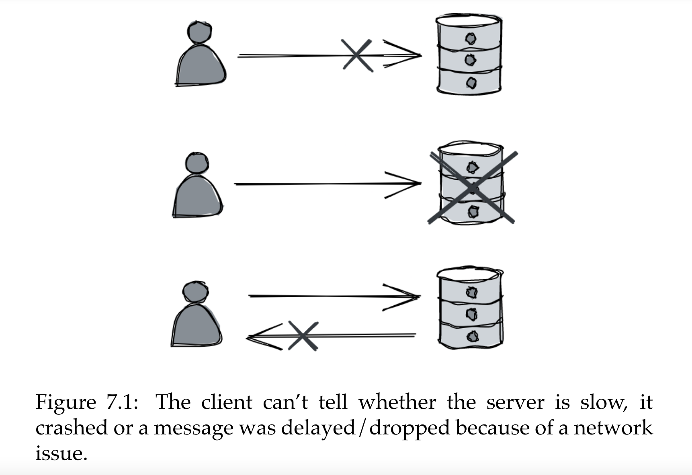
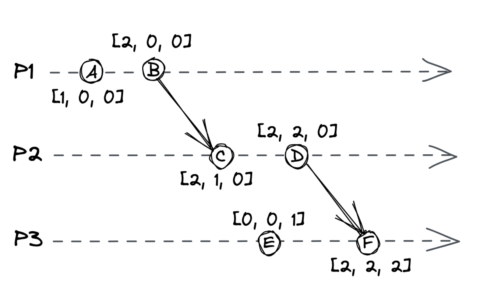
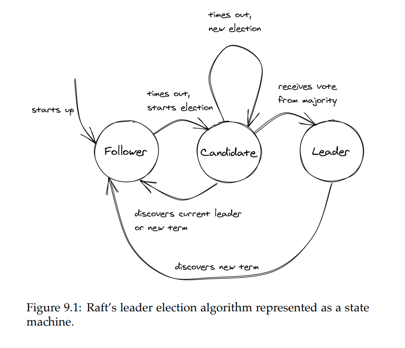

# Coordination

So far, focus is on making nodes communicate. Focus now is to make nodes coordinate as if they're a single coherent system.

## System Models
To reason about distributed systems, we must strictly define what can and cannot happen.

A system model is a set of assumptions about the behavior of processes, communication links and timing while abstracting away the complexities of the technology being used.

Some common models for communication links:
 * fair-loss link - messages may be lost and duplicated, but if sender keeps retransmitting messages, they will eventually be delivered.
 * reliable link - messages are delivered exactly once without loss or duplication. Reliable links can be implemented on top of fair-loss links by deduplicating messages at receiving end.
 * authenticated reliable link - same as reliable link but also assumes the receiver can authenticate the sender.

Although these models are abstractions of real communication links, they are useful to verify the correctness of algorithms.

We can also model process behavior based on the types of failures we can expect:
 * arbitrary-fault model - aka "Byzantine" model, the process can deviate from algorithm in unexpected ways, leading to crashes due to bugs or malicious activity.
 * crash-recovery model - process doesn't deviate from algorithm, but can crash and restart at any time, losing its in-memory state.
 * crash-stop model - process doesn't deviate from algorithm, it can crash and when it does, it doesn't come back online. Used to model unrecoverable hardware faults.

The arbitrary-fault model is used to describe systems which are safety-criticla or not in full control of all the processes - airplanes, nuclear power plants, the bitcoin digital currency.

This model is out of scope for the book. Algorithms presented mainly focus on the crash-recovery model.

Finally, we can model timing assumptions:
 * synchronous model - sending a message or executing an operation never takes more than a certain amount of time. Not realistic for the kinds of systems we're interested in.
    * Sending messages over the network can take an indefinite amount of time. Processes can also be slowed down by garbage collection cycles.
 * asynchronous model - sending a message or executing an operation can take an indefinite amount of time.
 * partially synchronous model - system behaves synchronously most of the time. Typically representative enough of real-world systems.

Throughout the book, we'll assume a system model with fair-loss links, crash-recovery processes and partial synchrony.

## Failure Detection
When a client sends a request to a server & doesn't get a reply back, what's wrong with the server?

One can't tell, it might be:
 * server is very slow
 * it crashed
 * there's a network issue

Worst case, client will wait forever until they get a response back. Possible mitigation is to setup timeout, back-off and retry.

However, a client need not wait until they have to send a message to figure out that the server is down. They can maintain a list of available processes which they ping or heartbeat to figure out if they're alive:
 * ping - periodic request from client to server to check if process is available.
 * heartbeat - periodic request from server to client to indicate that server is still alive.

Pings and heartbeats are used in situations where processes communicate with each other frequently, eg within a microservice deployment.

## Time
Time is critical in distributed systems:
 * On the network layer for DNS TTL records
 * For failure detection via timeouts
 * For determining ordering of events in a distributed system
 
The last use-case is one we're to tackle in the chapter. 

The challenge with that is that in distributed systems, there is no single global clock all services agree on unlike a single-threaded application where events happen sequentially.

We'll be exploring a family of clocks which work out the order of operations in a distributed system.

### Physical Clocks
Processes have access to a physical wall-time clock. Every machine has one. The most common one is based on a vibrating quartz crystal, which is cheap but not insanely accurate.

Because quartz clocks are not accurate, they need to be occasionally synced with servers with high-accuracy clocks.

These kinds of servers are equipped with atomic clocks, which are based on quantum mechanics. They are accurate up to 1s in 3 mil years.

Most common protocol for time synchronization is the Network Time Protocol (NTP).

Clients synchronize their clock via this protocol, which also factors in the network latency. The problem with this approach is that the clock can go back in time on the origin machine.

This can lead to a situation where operation A which happens after operation B has a smaller timestamp.

An alternative is to use a clock, provided by most OS-es - monotonic clock. It's a forward-only moving clock which measures time elapsed since a given event (eg boot up).

This is useful for measuring time elapsed between timestamps on the same machine, but not for timestamps across multiple ones.

### Logical Clocks
Logical clocks measure passing of time in terms of logical operations, not wall-clock time.

Example - counter, incremented on each operation. This works fine on single machines, but what if there are multiple machines.

A Lamport clock is an enhanced version where each message sent across machines includes the logical clock's counter. Receiving machines take into consideration the counter of the message they receive.

Subsequent operations are timestamped with a counter bigger than the one they received.

With this approach, dependent operations will have different timestamps, but unrelated ones can have identical ones.

To break ties, the process ID can be included as a second ordering factor.

Regardless of this, logical clocks don't imply a causal relationship. It is possible for event A to happen before B even if B's timestamp is greater.

### Vector Clocks
Vector clocks are logical clocks with the additional property of guaranteeing that event A happened before event B if A's timestamp is smaller than B.

Vector clocks have an array of counters, one for each process in the system:
 * Counters start from 0
 * When an operation occurs, the process increments its process' counter by 1
 * Sending a message increments the process' counter by 1. The array is included in the message
 * Receiving process merges the received array with its local one by taking the max for each element.
   * Finally, its process counter is incremented by 1 

This guarantees that event A happened before B if:
 * Every counter in A is `less than or equal` every counter in B
 * At least one counter in A is `less than` corresponding counter in B 

If neither A happened before B nor B happened before A, the operations are considered concurrent

In the above example:
 * B happened before C
 * E and C are concurrent

A downside of vector clocks is that storage requirements grow with every new process.
Other types of logical clocks, like [dotted version clocks](https://queue.acm.org/detail.cfm?id=2917756) solve this issue.

### Summary
Using physical clocks for timestamp is good enough for some records such as logs.

However, when you need to derive the order of events across different processes, you'll need vector clocks.

## Leader Election
There are use-cases where 1 among N processes needs to gain exclusive rights to accessing a shared resource or to assign work to others.

To achieve this, one needs to implement a leader-election algorithm - to elect a single process to be a leader among a group of equally valid candidates.

There are two properties this algorithm needs to sustain:
 * Safety - there will always be one leader elected at a time.
 * Liveness - the process will work correctly even in the presence of failures.

This chapter explores a particular leader-election algorithm - Raft, and how it guarantees these properties.

### Raft leader election
Every process is a state machine with one of three states:
 * follower state - process recognizes another process as a leader
 * candidate state - process starts a new election, proposing itself as a leader
 * leader state - process is the leader

Time is divided into election terms, numbered with consecutive integers (logical timestamp).
A term begins with a new election - one or more candidates attempt to become the leader.

When system starts up, processes begin their journey as followers. 
As a follower, the process expects a periodic heartbeat from the leader.
If one does not arrive, a timeout begins ticking after which the process starts a new election & transitions into the candidate state.

In the candidate state, the process sends a request to all other notes, asking them to vote for them as the new leader.

State transition happens when:
 * Candidate wins the election - majority of processes vote for process, hence it wins the election.
 * Another process wins - when a leader heartbeat is received \w election term index `greater than or equal` to current one.
 * No one wins election - due to split vote. Then, after a random timeout (to avoid consecutive split votes), a new election starts.

### Practical considerations
There are also other leader election algorithms but Raft is simple & widely used.

In practice, you would rarely implement leader election from scratch, unless you're aiming to avoid external dependencies.

Instead, you can use any fault-tolerant key-value store \w support for TTL and linearizable CAS (compare-and-swap) operations.
This means, in a nutshell, that operations are atomic & there is no possibility for race conditions.

However, there is a possibility for race conditions after you acquire the lease.

It is possible that there is some network issue during which you lose the lease but you still think you're the leader.
This has [lead to big outages in the past](https://ravendb.net/articles/avoid-rolling-your-own-leader-election-algorithm)

As a rule of thumb, leaders should do as little work as possible & we should be prepared to occasionally have more than one leaders.

## Replication
