# Scalability
- [Scalability](#scalability)
- [HTTP Caching](#http-caching)
- [Content delivery networks](#content-delivery-networks)
- [Partitioning](#partitioning)
- [File storage](#file-storage)
- [Network load balancing](#network-load-balancing)
- [Data storage](#data-storage)
- [Caching](#caching)
- [Microservices](#microservices)
- [Control planes and data planes](#control-planes-and-data-planes)
- [Messaging](#messaging)
- [Summary](#summary)

Over the last decades, the number of people with internet access has risen.
This has lead to the need for businesses to handle millions of concurrent users.

To scale, an application must run without performance degradation. The only long-term solution is to scale horizontally.

This part focuses on scaling a small CRUD application:
 * REST API
 * SPA JavaScript front-end
 * Images are stored locally on the server
 * Both database & application server are hosted on the same machine - AWS EC2
 * Public IP Address is managed by a DNS service - AWS Route53
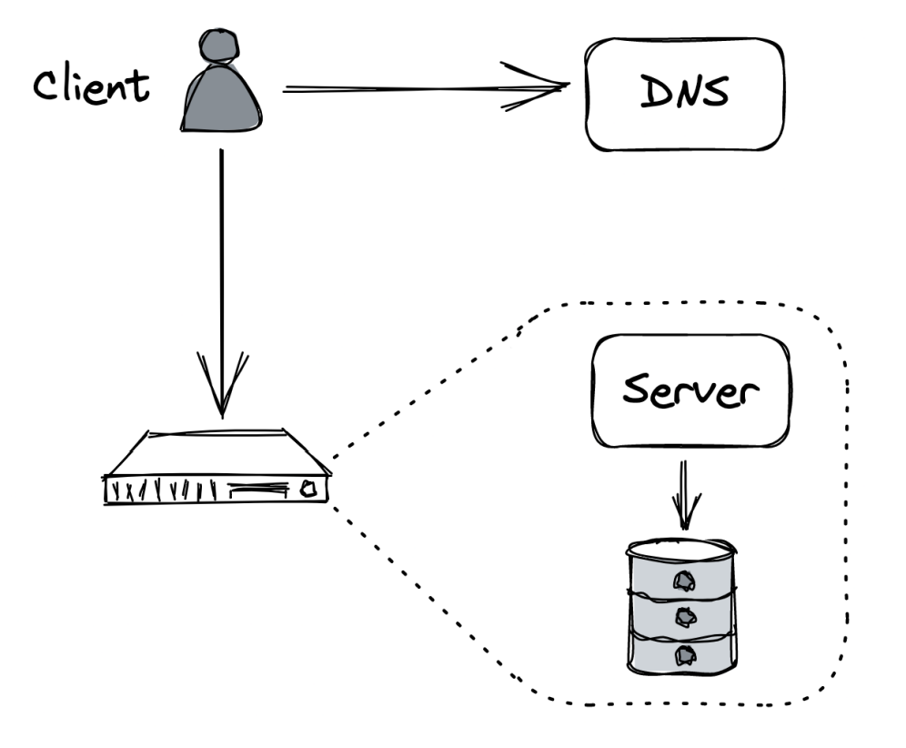

Problems:
 * Not scalable
 * Not fault-tolerant

Naive approach to scaling - scale up by adding more CPU, RAM, Disk, etc.

Better alternative is to scale out - eg move the database to a dedicated server.

This increases the capacity of both the server and the database. 
This technique is called **functional decomposition** - application is broken down to independent components with distinct responsibilities.

Other approaches to scaling:
 * Partitioning - splitting data into partitions & distributing it among nodes.
 * Replication - replicating data or functionality across nodes.

The following sections explore different techniques to scale.

# HTTP Caching
Cruder handles static & dynamic resources:
 * Static resources don't change often - HTML, CSS, JS files
 * Dynamic resources can change - eg a user's profile JSON

Static resources can be cached since they don't change often.
A client (ie browser) can cache the resource so that subsequent access doesn't make network calls to the server.

We can leverage HTTP Caching, which is limited to GET and HEAD HTTP methods.

The server issues a `Cache-Control` header which tells the browser how to handle the resource:
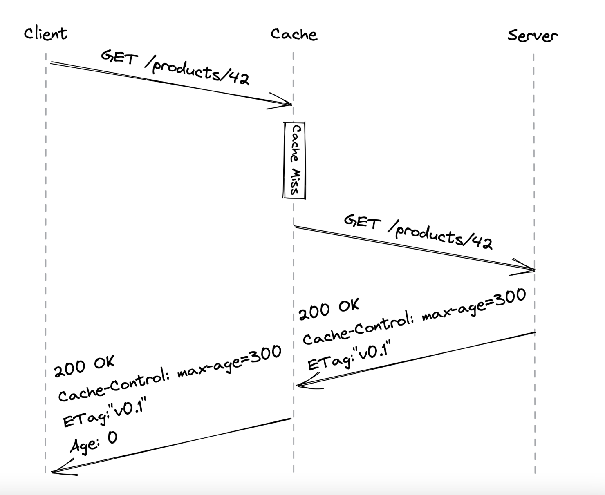

The max-age is the TTL of the resource and the ETag is the version identifier. 
The age is maintained by the cache & indicates for how long has the resource been cached.

If a subsequent request for the resource is received, the resource is served from the cache as long as it is still fresh - TTL hasn't expired.
If, however, the resource has changed on the server in the meantime, clients won't get the latest version immediately.

Reads, therefore, are not strongly consistent.

If a resource has expired, the cache will forward a request to the server asking if it's change. If it's not, it updated its TTL:

One technique we can use is treating static resources as immutable.
Whenever a resource changes, we don't update it. Instead, we publish a new file (\w version tag) & update references to it.

This has the advantage of atomically changing all static resources with the same version.

Put another way, with HTTP caching, we're treating the read path differently from the write path because reads are way more common than writes.
This is referred to as the Command-Query Responsibility Segregation (CQRS) pattern.

### Reverse Proxies
An alternative is to cache static resources on the server-side using reverse proxies.

A reverse proxy is a server-side proxy which intercepts all client calls. It is indistinguishable from the actual server, therefore clients are unaware of its presence.

A common use-case for reverse proxies is to cache static resources returned by the server. 
Since this cache is shared among clients, it will reduce the application server's burden.

Other use-cases for reverse proxies:
 * Authenticate requests on behalf of the server.
 * Compress a response before forwarding it to clients to speed up transmission speed.
 * Rate-limit requests coming from specific IPs or users to protect the server from DDoS attacks.
 * Load-balance requests among multiple servers to handle more load.

NG-INX and HAProxy are popular implementations which are commonly used.
However, caching static resources is commoditized by managed services such as Content delivery networks (CDNs) so we can just leverage those.

# Content delivery networks
CDN - overlay network of geographically distributed caches (reverse proxies), designed to workaround the network protocol.

When you use CDN, clients hit URLs that resolve to the CDN's servers. If a requested resource is stored in there, it is given to clients. If not, the CDN transparently fetches it from the origin server.

Well-known CDNs - Amazon CloudFront and Akamai.

## Overlay network
The main benefit of CDNs is not caching. It's main benefit is the underlying network architecture.

The internet's routing protocol - BGP, is not designed with performance in mind. 
When choosing routes for a package, it takes into consideration number of hops instead of latency or congestion.

CDNs are built on top of the internet, but exploit techniques to reduce response time & increase bandwidth.

It's important to minimize distance between server and client in order to reduce latency. Also, long distances are more error prone.

This is why clients communicate with the CDN server closest to them. 
One way to achieve that is via DNS load balancing - a DNS extension which infers a client's location based on its IP and returns a list of geographically closest servers.

CDNs are also placed at internet exchange points - network nodes where ISPs intersect. This enables them to short-circuit communication between client and server via advanced routing algorithms.
These algorithms take into consideration latency & congestion based on constantly updated data about network health, maintained by the CDN providers.
In addition to that, TCP optimizations are leveraged - eg pooling TCP connections on critical paths to avoid setting up new connections every time.
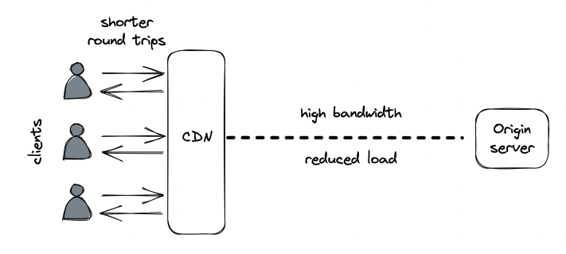

Apart from caching, CDNs can be leveraged for transporting dynamic resources from client to server for its network transport efficiency.
This way, the CDN effectively becomes the application's frontend, shielding servers from DDoS attacks.

## Caching
CDNs have multiple caching layers. The top one is at edge servers, deployed across different geographical regions.

Infrequently accessed content might not be available in edge servers, hence, it needs to be fetched from the origin using the overlay network for efficiency.

There is a trade-off though - more edge servers can reach more clients, but reduce the cache hit ratio. 
Why? More servers means you'll need to "cache hit" a content in more locations, increasing origin server load.

To mitigate this, there are intermediary caching layers, deployed in fewer geographical regions. Edge servers first fetch content from there, before going to the origin server.

Finally, CDNs are partitioned - there is no single server which holds all the data as that's infeasible. It is dispersed across multiple servers and there's an internal mechanism which routes requests to the appropriate server, which contains the target resource.

# Partitioning
When an application's data grows, at some point it won't fit in a single server. 
That's when partitioning can come in handy - splitting data (shards) across different servers.

An additional benefit is that the application's load capacity increases since load is dispersed across multiple servers vs. a single one.

When a client makes a request to a partitioned system, it needs to know where to route the request.
Usually, a gateway service (reverse proxy) is in charge of this. Mapping of partitions to servers is usually maintained in a fault-tolerant coordination service such as zookeeper or etcd.

Partitioning, unfortunately, introduces a fair amount of complexity:
 * Gateway service is required to route requests to the right nodes.
 * Data might need to be pulled from multiple partitions & aggregated (eg joins across partitions)
 * Transactions are needed to atomically update data across multiple partitions, which limits scalability.
 * If a partition is much more frequently accessed than others, it becomes a bottleneck, limiting scalability.
 * Adding/removing partitions at runtime is challenging because it involves reorganizing data.

Caches are ripe for partitioning as they:
 * don't need to atomically update data across partitions
 * don't need to join data across partitions as caches usually store key-value pairs
 * losing data due to changes in partition configuration is not critical as caches are not the source of truth
 
In terms of implementation, data is distributed using two main mechanisms - hash and range partitioning.
An important prerequisite for partitioning is for the number of possible keys be very large. Eg a boolean key is not appropriate for partitioning.

## Range partitioning
With this mechanism, data is split in lexicographically sorted partitions:

To make range scanning easier, data within a partition is kept in sorted order on disk.

Challenges:
 * How to split partitions? - evenly distributing keys doesn't make sense in eg the english alphabet due to some letters being used more often. This leads to unbalanced partitions.
 * Hotspots - if you eg partition by date & most requests are for data in the current day, those requests will always hit the same partition. Workaround - add a random prefix at the cost of increased complexity.

When data increases or shrinks, the partitions need to be rebalanced - nodes need to be added or removed.
This has to happen in a way which minimizes disruption - minimizing data movement around nodes due to the rebalancing.

Solutions:
 * Static partitioning - define a lot of partitions initially & nodes serve multiple partitions vs. a single one.
    * drawback 1 - partition size is fixed
    * drawback 2 - trade-off between lots of partitions & too few. Too many -> decreased performance. Too few -> limit scalability.
 * Dynamic partitioning - system starts with a single partition & is rebalanced into sub-partitions over time. 
    * If data grows, partition is split into two sub-partitions. 
    * If data shrinks, sub-partitions are removed & data is merged.

## Hash partitioning
Use a hash function which deterministically maps a key to a seemingly random number, which is assigned to a partition.
Hash functions usually distribute keys uniformly.

Challenge - assigning hashes to partitions.
 * Naive approach - use the module operator. Problem - rebalancing means moving almost all the data around.
 * Better approach - consistent hashing.

How consistent hashing works:
 * partitions and keys are randomly distributed in a circle.
 * Each key is assigned to the closest partition which appears in the circle in clockwise order.

Adding a new partition only rebalances the keys which are now assigned to it in the circle:
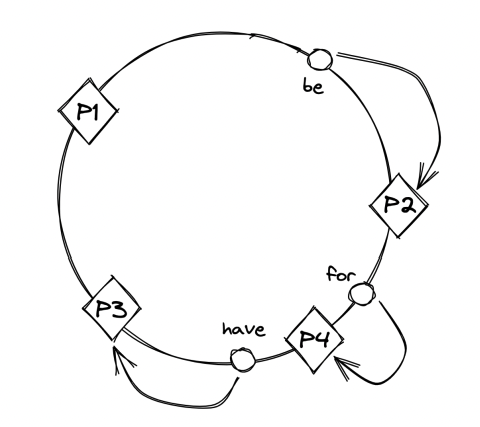

Main drawback of hash partitioning - sorted order is lost. This can be mitigated by sorting data within a partition based on a secondary key.

# File storage
Using CDNs enables our files to be quickly accessible by clients. However, our server will run out of disk space as the number of files we need to store increases.

To work around this limit, we can use a managed file store such as AWS S3 or Azure Blob Storage.

Managed file stores scalable, highly available & offer strong durability guarantees.
In addition to that, managed file stores enable anyone with access to its URL to point to it, meaning we can point our CDNs to the file store directly.

## Blob storage architecture
This section explores how distributed blob stores work under the hood by exploring the architecture of Azure Storage.

Side note - AS works with files, tables and queues, but discussion is only focused on the file (blob) store.

AS Architecture in a nutshell:
 * Composed of different racks of clusters, which are geographically distributed. Each node in a cluster has separate network & (redundant) power supply.
 * file URL are composed of account name + file name - https://{account_name}.blob.core.windows.net/{filename}
 * Customer sets up account name & AS DNS uses that to identify the storage cluster where the data is located. The filename is used to detect the correct node within the cluster.
 * A location service acts as a control plane, which creates accounts & allocates them to clusters.
   * Creating a new account leads to the location service 1) choosing an appropriate cluster, 2) updating the cluster configuration to accept requests for that account name and 3) updates the DNS records 
 * The storage cluster itself is composed of a front-end, partition and stream layers.

The Stream layer implements a distributed append-only file system in which the data is stored in "streams". A stream is represented as a sequence of "extents", which are replicated using [chain replication](https://github.com/preslavmihaylov/booknotes/tree/master/system-design/understanding-distributed-systems/part02#chain-replication).
A stream manager acts as the control plane within the stream layer - it 1) allocates extents to the list of chained servers and 2) handles faults such as missing extent replicas.

Partition layer is the abstraction where high-level file operations are translated to low-level stream operations.

The partition layer also has a dedicated control plane, called the partition manager. It maintains an index of all files within the cluster.
The partition manager range-partitions the index into separate partition servers. It also load-balances partitions across servers by splitting/merging them as necessary.
The partition manager also replicates accounts across clusters for the purposes of migration in the event of disaster and for load-balancing purposes.

Finally, the front-end layer is a stateless reverse proxy which authenticates requests and routes them to appropriate partitions.

Side note - AS was strongly consisten from the get-go, while AWS S3 started offering strong consistency in 2021.

# Network load balancing
So far we've scaled by offloading files into a dedicated file storage service + leveraging CDN for caching & its enhanced networking.

However, we still have a single application server.
To avoid this, we can instantiate multiple application servers hidden behind a load balancer, which routes requests to them, balancing the load on each.

This is possible because the application server is stateless. State is encapsulated within the database & file store.
Scaling out a stateful application is a lot harder as it requires replication & coordination.

General rule - push state to dedicated services, which are stable & highly efficient.

The load balancer will also track our application's health and stop routing requests to faulty servers. This leads to increased availability.

Availability == probability of a valid request succeeding.

How is theoretical availability calculated? - 1 - (product of the servers' failure rate).

Eg. two servers with 99% availability == 1 - (0.01 * 0.01) == 99.99%.

Caveats:
 * There is some delay between a server crashing and a load balancer detecting it.
 * Formula assumes failure rates are independent, but often times they're not.
 * Removing a server from the pool increases the load on other servers, risking their failure rates increasing.

**Load balancing**

Example algorithms:
 * Round robin
 * Consistent hashing
 * Taking into account server's load - this requires load balancers to periodically poll the server for its load
   * This can lead to surprising behavior - server reports 0 load, it gets hammered with requests and gets overloaded.

In practice, round robin achieves better results than load distribution. 
However, [an alternative algorithm](https://brooker.co.za/blog/2012/01/17/two-random.html) which randomizes requests across the least loaded servers achieves better results.

**Service discovery**
This is the process load balancers use to discover the pool of servers under your application identifier.

Approaches:
 * (naive) maintain a static configuration file mapping application to list of IPs. This is painful to maintain. 
 * Use Zookeeper or etcd to maintain the latest configuration

Adding/removing servers dynamically is a key functionality for implementing autoscaling, which is supported in most cloud providers.

**Health checks**
Load balancers use health checks to detect faulty servers and remove them from the pool.

Types of health check:
 * Passive - healh check is piggybacked on top of existing requests. Timeout or status 503 means the server is down and it is removed.
 * Active - servers expose a dedicated `/health` endpoint and the load balancer actively polls it.
   * This can work by just returning OK or doing a more sophisticated check of the server's resources (eg DB connection, CPU load, etc). 
   * **Important note** - a bug in the `/health` endpoint can bring the whole application down. Some smart load balancers can detect this anomaly & disregard the health check.

Health checks can be used to implement rolling updates - updating an application to a new version without downtime:
 * During the update, a number of servers report as unavailable. 
 * In-flight requests are completed (drained) before servers are restarted with the new version.

This can also be used to restart eg a degraded server due to (for example) a memory leak:
 * A background thread (watchdog) monitors a metric (eg memory) and if it goes beyond a threshold, server forcefully crashes.
 * The watchdog implementation is critical - it should be well tested because a bug can degrade the entire application.

## DNS Load balancing
A simple way to implement a load balancer is via DNS.

We add the servers' public IPs as DNS records and clients can pick one:
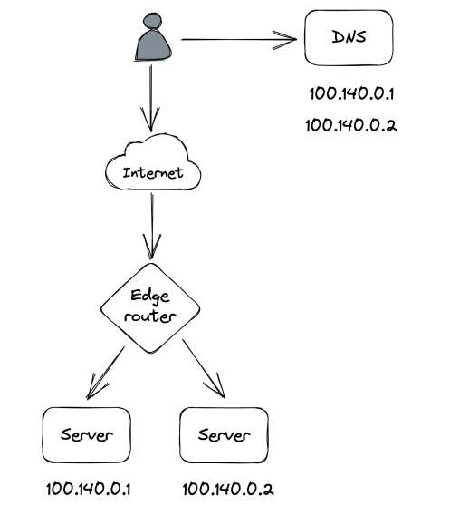

The main problem is the lack of fault tolerance - if one of the servers goes down, The DNS server will continue routing requests to it. 
Even if an operator manages to reconfigure the DNS records, it takes time for the changes to get propagated due to DNS caching.

The one use-case where DNS load balancing is used is to route traffic across multiple data centers.

## Network load balancing
A more flexible approach is implementing a load balancer, operating at the TCP layer of the network stack.
 * Network load balancers have one or more physical network cards mapped to virtual IPs (VIPs). A VIP is associated with a pool of servers.
 * Clients only see the VIP, exposed by the load balancer.
 * The load balancer routes client requests to a server from the pool and it detects faulty servers using passive health checks.
 * The load balancer maintains a separate TCP connection to the downstream server. This is called TCP termination.
 * Direct server return is an optimization where responses bypass the L4 load balancer & go to the client directly.
 * Network load balancers are announced to a data center's router, which can load balance requests to the network load balancers.

Managed solutions for network load balancing:
 * AWS Network Load Balancer
 * Azure Load Balancer

Load balancing at the TCP layer is very fast, but it doesn't support features involving higher-level protocols such as TLS termination.

## Application layer load balancing
Application layer load balancers (aka L7 load balancers) are HTTP reverse proxies which distribute requests over a pool of servers.

There are two TCP connections at play - between client and load balancer and between load balancer and origin server.

Features L7 load balancers support:
 * Multiplexing multiple HTTP connections over the same TCP connection
 * Rate limiting HTTP requests
 * Terminate TLS connections
 * Sticky sessions - routing requests belonging to the same session onto the same server (eg by reading a cookie)

Drawbacks:
 * Much lower throughput than L4 load balancers.
 * If a load balancer goes down, the application behind it goes down as well.

One way to off-load requests from an application load balancer is to use the sidecar proxy pattern. This can be applied to clients internal to the organization.
Applications have a L7 load balancer instance running on the same machine. All application requests are routed through it.

This is also referred to as a service mesh.

Popular sidecar proxy load balancers - NGINX, HAProxy, Envoy.

Main advantage - delegates load balancing to the client, avoiding a single point of failure.

Main disadvantage - there needs to be a control plane which manages all the side cars.

# Data storage
The next scaling target is the database. Currently, it's hosted on a single server.

## Replication
We can increase the read capacity of the database by using leader-follower replication:

Clients send writes to the leader. The leader persists those in its write-ahead log. 
Replicas connect to the leader & stream log entries from it to update their state.
They can disconnect and reconnect at any time as they maintain the log sequence number they've reached, from which they continue the stream.

This helps with:
 * Increasing read capacity
 * Increasing database availability
 * Expensive analytics queries can be isolated to a follower in order to not impact the rest of the clients

Replication can be configured as:
 * fully synchronous - leader broadcasts writes to followers & immediately returns a response to the client
   * Minimum latency, but not fault tolerant. Leader can crash after acknowledgment, but before broadcast. 
 * fully asynchrnous - leader waits for acknowledgment from followers before acknowledging to the client
  * Highly consistent but not performant. A single slow replica slows down all the writes. 
 * hybrid of the two - some of the followers receive writes synchronously, others receive it asynchronously
  * This is the default behavior for PostgreSQL
  * If a leader crashes, we can fail over to the synchrnous follower without incurring any data loss.

Replication increases read capacity, but it still requires the database to fit on a single machine.

## Partitioning
Enables us to scale a database for both reads and writes.

Traditional relational databases don't support partitioning out of the box, so we can implement in in the application layer.

In practice, this is quite challenging:
 * We need to decide how to split data to be evenly distributed among partitions.
 * We need to handle rebalancing when a partition becomes too hot or too big.
 * To support atomic transactions, we need to add support for two-phase commit (2PC).
 * Queries spanning multiple partitions need to be split into sub-queries (ie aggregations, joins).

Fundamental problem of relational databases is that they were designed under the assumption that they can fit on a single machine.
Due to that, hard-to-scale features such as ACID and joins were supported.

In addition to that, relational databases were designed when disk space was costly, so normalizing the data was encouraged to reduce disk footprint.
This came at a significant cost later to unnormalize the data via joins.

Times have changed - storage is cheap, but CPU time isn't.

Since the 2000s, large tech companies have started to invest in data storage solutions, designed with high availability and scalability in mind.

## NoSQL
Some of the early designs were inefficient compared to traditional SQL databases, but the Dynamo and Bigtable papers were foundational for the later growth of these technologies.

Modern NoSQL database systems such as HBase and Cassandra are based on them.

Initially, NoSQL databases didn't support SQL, but nowadays, they support SQL-like syntax.

Traditional SQL systems support strong consistency models, while NoSQL databases relax consistency guarantees (ie eventual/causal consistency) in favor of high availability.
NoSQL systems usually don't support joins and rely on the data being stored unnormalized.

Main NoSQL flavors store data as key-value pairs or as document store. The main difference is that the document store enables indexing on internal structure.
A strict schema is not applied in both cases.

Since NoSQL databases are natively created with partitioning in mind, there is limited (if any) support for transactions.
However, due to data being stored in unnormalized form, there is less need for transactions or joins.

A very bad practice is try to store a relational model in a NoSQL database. This will result in the worst of both worlds.
If used correctly, NoSQL can handle most of the use-cases a relational database can handle, but with scalability from day one.

The main prerequisite for using NoSQL database is to know the access patterns beforehand and model the database with those in mind since NoSQL databases are hard to alter later.

For example, let's take a look at DynamoDB:
 * A table consists of items. Each table has a partition key and optionally a sort key (aka clustering key).
 * The partition key dictates how data is partitioned and distributed among nodes. 
 * The clustering key dictates how the data is sorted within partitions - this enables efficient range queries.
 * DynamoDB maintains three replicas per partition which are synchronized using state machine replication.
 * Writes are routed to the leader. Acknowledgment is sent once 2 out of 3 replicas have received the update.
 * Reads can be eventually consistent (if you query any replica) or strongly consistent (if you query the leader).

DynamoDB's API supports:
 * CRUD on single items.
 * Querying multiple items with the same partition key and filtering based on the clustering key.
 * Scanning the entire table.

Joins aren't supported by design. We should model our data to not need joins in the first place.

Example - modeling a table of orders:
 * We should model the table with access patterns in mind. Let's say the most common operation is grabbing orders of a customer, sorted by order creation time.
 * Hence, we can use the customer ID as the partition key and the order creation time as the clustering key.

SQL databases require that you store a given entity type within a single table. NoSQL enables you to store multiple entity types within the same table.

Eg if we want to also include a customer's full name in an order, we can add a new entry against the same partition key within the same table:

A single query can grab both entities within this table, associated to a given customer, because they're stored against the same partition key. 

More complex access patterns can be modeled via secondary indexes, which is supported by DynamoDB:
 * Local secondary indexes allow for more sort keys within the same table.
 * Global secondary indexes enable different partition and sort keys, with the caveat that index updates are asynchronous and eventually consistent.

Main Drawback of NoSQL databases - much more thought must be put upfront to design the database with the access patterns in mind. 
Relational databases are much more flexible, enabling you to change your access patterns at runtime.

To learn more about NoSQL databases, the author recommends [The DynamoDB Book](https://www.dynamodbbook.com/), even if you plan to use a different NoSQL database.

The latest trend is to combine the scalability of NoSQL databases with the ACID guarantees of relational databases. This trend is referred to as NewSQL.

NoSQL databases favor availability over consistency in the event of network partitions. NewSQL prefer consistency.
The argument is that with the right design, the reduction of availability due to preferring strong consistency is barely noticeable.

CochroachDB and Spanner are well-known NewSQL databases.

# Caching
Whenever a significant portion of requests is for a few frequently accessed objects, then that workflow is suitable for caching.

Caches improves the app's performance and reduces the load on the data store:
 * It's a high-speed storage layer that buffers responses from the origin data store.
 * It provides best-effort guarantees since it isn't the source of truth. Its state can always be rebuilt from the origin.

In order for a cache to be cost-effective, the proportion of requests which hit the cache vs. hitting the origin should be high (hit ratio).

The hit ratio depends on:
 * The total number of cacheable objects - the fewer, the better
 * The probability of accessing the same object more than once - the higher, the better
 * The size of the cache - the larger, the better

The higher in the call stack a cache is, the more objects it can capture. 

Be wary, though, that caching is an optimization, which doesn't make a scalable architecture. 
Your original data store should be able to withstand all the requests without a cache in front of it.
It's acceptable for the requests to become slower, but it's not acceptable for your entire data store to crash.

## Policies
Whenever there's a cache miss, the missing object has to be requested from the origin.

There are two ways (policies) to handle this:
 * Side Cache - The application requests the object from the origin and stores it in the cache. The cache is treated as a key-value store.
 * Inline Cache - The cache communicates with the origin directly requesting the missing object on behalf of the application. The app only accesses the cache.

Side cache (write-through-aside) example:

Inline cache (aka Write-through) example:

Something which wasn't mentioned in the book is a write-back cache. It acts as a write-through cache, but asynchronously updates the data store.
This one is way more complex to implement:
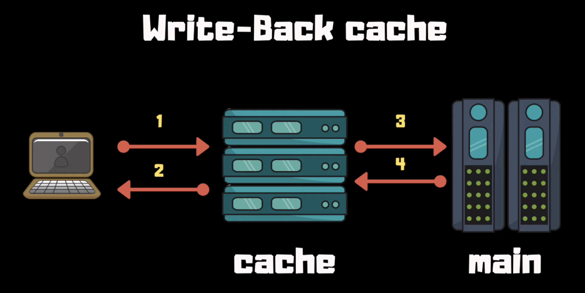

Whenever the cache has limited capacity, entries must be evicted from it. 
The eviction policy defines that. The most common eviction policy is LRU - least-recently used elements are evicted first.

The expiration policy defines how long are objects stored in the cache before they're refreshed from the origin (TTL).

The higher the TTL, the higher the hit ratio, but also the higher the chance of serving stale objects.
Eviction need not occur immediately. It can be deferred to the next time an object is accessed.
This might be preferable so that if the origin data store is down, your application continues returning data albeit stale.

Cache invalidation - automatically expiring objects when they change, is hard to implement in practice. That's why TTL is used as a workaround.

## Local cache
Simplest way to implement a cache is to use a library (eg Guava in Java or [RocksDB](https://github.com/facebook/rocksdb/)), which implements an in-memory cache.
This way, the cache is embedded within the application.

Different replicas have different caches, hence, objects are duplicated & memory is wasted.
These kinds of caches also cannot be partitioned or replicated - if every client has 1GB of cache, then the total capacity of the cache is 1GB.

Consistency issues will also arise - separate clients can see different versions of an object.

More application replicas mean more caches, which result in more downstream traffic towards the origin data store.
This issue is particularly prevalent when the application restarts, caches are empty and the origin is hit with a lot of concurrent requests.
Same thing can happen if an object instantly becomes popular and becomes requested a lot.

This is referred to as "thundering herd". You can reduce its impact by client-side rate limiting.

## External cache
External service, dedicated to caching objects, usually in-memory for performance purposes.

Because it's shared, it resolves some of the issues with local caches. at the expense of greater complexity and cost.

Popular external caches - Redis and Memcached.

External caches can increase their throughput and size via replication and partitioning - Redis does this, for example.
Data can automatically partition data & also replicate partitions using leader-follower election.

Since cache is shared among clients, they consistently see the same version of an object - be it stale or not.
Replication, however, can lead to consistency issues.

The number of requests towards the origin doesn't grow with the growth in application instances.
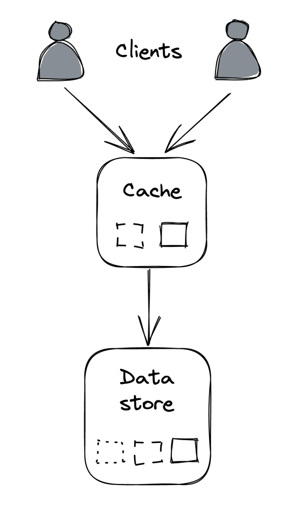

External caches move the load from the origin data store towards itself. Hence, it will need to be scaled out eventually.

When that happens, as little data should be moved around as possible to avoid having the hit ratio drop significantly. 
Consistent hashing can help here.

Other drawbacks of external caches:
 * Maintenance cost - in contrast to local caches, external ones are separate services which need to be setup & maintained.
 * Higher latency than local caches due to the additional network calls.

If the external cache is down, how can clients mitigate that?
One option is to bypass it & access the origin directly, but that can lead to cascading failures due to the origin not being able to handle the load.

Optionally, applications can maintain an in-process cache as a backup in case the external cache crashes.

# Microservices
A monolithic application consists of a single code base \w multiple independent components in it:
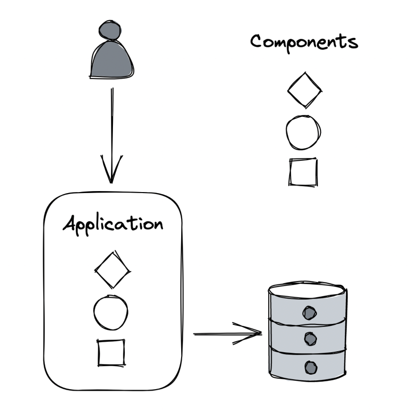

Downsides of a monolithic system:
 * Components will become increasingly coupled over time & devs will step on each others toes quite frequently.
 * The code base at some point will become too large for anyone to fully understand it - adding new features or fixing bugs becomes more time-consuming than it used to.
 * A change in a component leads to the entire application being rebuilt & redeployed.
 * A bug in one component can impact multiple unrelated components - eg memory leak.
 * Reverting a deployment affects the velocity of all developers, not just the one who introduced a bug.

To mitigate this, one could functionally decompose the large code base into a set of independently deployable services, communicating via APIs:
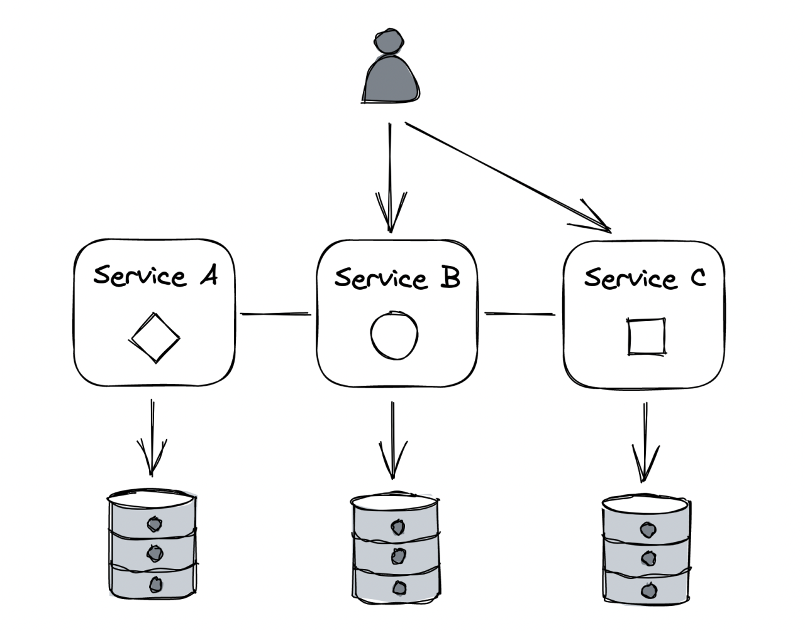

The decomposition creates a boundary between components which is hard to violate, unlike boundaries within a code base.

Outcome of using microservices:
 * Each service is owned and operated by a small team - less communication is necessary across teams.
 * Smaller teams communicate more effectively than larger ones, since communication overhead grows quadratically as team size increases.
 * The surface area of an application is smaller, making it more digestible to engineers.
 * Teams are free to adopt the tech stack & hardware they prefer.

Good practices:
 * An API should have a small surface area, but encapsulate a significant amount of functionality.
 * Services shouldn't be too "micro" as that adds additional operational load & complexity.

## Caveats
Splitting your application into multiple services has benefits but it also has a lot of downsides. It is only worth paying the price if you'll be able to amortize it across many development teams.

1. Tech Stack

Nothing forbids teams from using a different tech stack than everyone else. Doing so, makes it difficult for developers to move across teams.

In addition to that, you'll have to support libraries in multiple languages for your internal tools.

It's reasonable to enforce a certain degree of standardization. One way of doing this is to provide a great developer experience for some technologies, but not others.

### Communication

Remote calls are expensive & non-deterministic. Making them within the same process removes a lot of the complexity of distributed systems.

### Coupling

Microservices ought to be loosely coupled. Changes in one service shouldn't propagate to multiple other services. 
Otherwise, you end up with a distributed monolith, which has the downsides of both approaches.

Examples of tight coupling:
 * Fragile APIs require clients to be updated on every change.
 * Shared libraries which have to be updated in lockstep across multiple services.
 * Using static IP addresses to reference external services.

### Resource provisioning

It should be easy to provision new services with dedicated hardware, data stores, etc.

You shouldn't make every team do things in their own (slightly different) way.

### Testing

Testing microservices is harder than testing monoliths because subtle issues can arise from cross-service integrations.

To have high confidence, you'll have to develop sophisticated integration testing mechanisms.

### Operations

Ease of deployment is critical so that teams don't deploy their services differently.

In addition to that, debugging microservices is quite challenging locally so you'll need a sophisticated observability platform.

### Eventual Consistency

The data model no longer resides in a single data store. 

Hence, atomic updates across a distributed system is more challenging.
Additionally, guaranteeing strong consistency has a high cost which is often not worth paying so we fallback to eventual consistency.

### Conclusion

It is usually best to start with a monolith & decompose it once there's a good enough reason to do so.

Once you start experiencing growing pains, you can start to decompose the monolith, one microservice at a time.

## API Gateway
When using microservices, letting clients make requests to services can be costly.

For example, mobile devices might have a hard time performing an expensive operation which involves interacting with multiple APIs as every API call consumes battery life.

In addition to that, clients need to be aware of implementation details such as a service's name.
This makes it hard to modify the application architecture as it requires changing the clients as well.

Once you have a public API out, you have to be prepared to maintain it for a very long time.

As a solution, we can hide the internal APIs behind a facade called the API gateway.
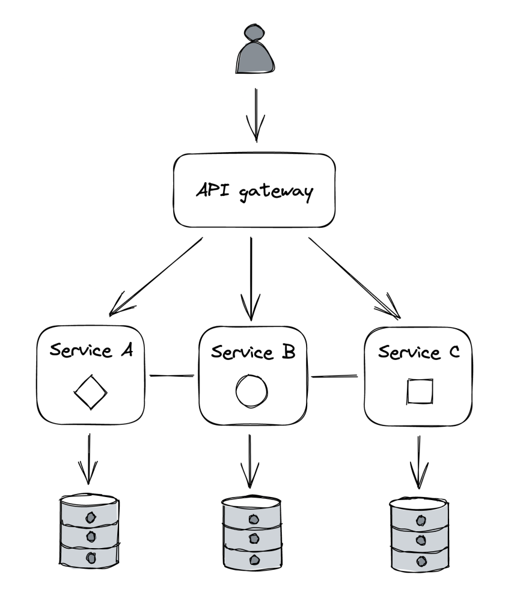

Here are some of the core responsibilities.

### Routing
You can map public endpoints to internal ones. 

If there is a 1:1 mapping, the internal endpoint can change, but the public one can stay the same.

### Composition
We might encounter use-cases where we have to stitch data together from multiple sources.

The API gateway can offer a higher-level API that composes a response from the data of multiple services.

This relieves the client from knowing internal service details & reduces the number of calls it has to perform to get the data it needs.

Be wary that the availability of an API decreases as the number of composed internal services increases.

### Translation
The API Gateway can transform from one IPC mechanism to another - eg gRPC to REST.
Additionally, it can expose different APIs to different clients. Eg a desktop-facing API can include more data than a mobile-facing one.

Graph-based APIs are a popular mechanism to allow the client to decide for itself how much data to fetch - GraphQL is a popular implementation.

This reduces development time as there is no need to introduce different APIs for different use-cases.

### Cross-cutting concerns
Cross-cutting functionality can be off-loaded from specific services - eg caching static resources or rate-limiting 

The most critical cross-cutting concerns are authentication and authorization (authN/authZ).

A common way to implement those is via sessions - objects passed through by client in subsequent requests.
These store a cryptographically secure session object, which the server can read and eg extract a user id.

Authentication is best left to the API gateway to enable multiple authentication mechanisms into a service, without it being aware.
Authorization is best left to individual services to avoid coupling the API gateway with domain logic.

The API gateway passes through a security token into internal services. They can obtain the user identity and roles via it.

Tokens can be:
 * Opaque - services call an external service to get the information they need about a user.
 * Transparent - the token contains the user information within it.

Opaque tokens require an external call, while transparent ones save you from it, but it is harder to revoke them if they're compromised.
If we want to revoke transparent tokens, we'll need to store them in a "revoked_tokens" store or similar.

The most popular transparent token standard is JWT - json payload with expiration date, user identity, roles, metadata.
The payload is signed via a certificate, trusted by internal services.

Another popular auth mechanism is using API keys - popular for implementing third-party APIs.

### Caveats
The API Gateway has some caveats: 
 * It can become a development bottleneck since it's tightly coupled with the internal APIs its proxying to.
 * Whenever an internal API changes, the API gateway needs to be changed as well.
 * It needs to scale to the request rate for all the services behind it.

If an application has many services and APIs, an API gateway is usually a worthwhile investment.

How to implement it:
 * Build it in-house, using a reverse proxy as a starting point (eg NGINX)
 * Use a managed solution, eg Azure API Management, Amazon API Gateway

# Control planes and data planes
The API Gateway is a single point of failure. If it goes down, so does our application. Hence, this component should be scalable & highly available.

There are some challenges related to external dependencies - eg gateway has a "configuration" endpoint which updates your rate-limits for endpoints.
This endpoint has a lot less load than normal endpoints. In those cases, we should favor availability vs. consistency. In this case, we should favor consistency.

Due to these differing requirements, we're splitting the API gateway into a "data plane" which handles external requests and a "control plane" which manages configuration & metadata.
This split is a common pattern.

The data plane includes functionality on the critical path that needs to run for each client request - it needs to be highly available, fast & scale with increase in load.
A control plane is not on the critical path & has less need to scale. Its job is to manage the configuration for the data plane.

There can be multiple control planes - one which scales service instances based on load, one which manages rate limiting configuration.

However, this separation introduces complexity - the data plane needs to be designed to withstand control plane failures.
If the data plane crashes as control plane crashes, there is a hard dependency on the control plane.

When there's a chain of components that depend on each other, the theoretical availability is their independent availability's product (ie 50% * 50% = 25%).
A system can be as available as its least available hard dependency.

The data plane, ideally, should continue running with the last seen configuration vs. crashing in the event of control plane failures.

## Scale imbalance
Since data planes & control planes have different scaling requirements, it is possible for the data plane to overload the control plane.

Example - there's a control plane endpoint which the data plane periodically polls. 
If the data plane restarts, there can be a sudden burst in traffic to that endpoint as all of the refreshes align.

If part of the data plane restarts but can't reach the control plane, it won't be able to function.

To mitigate this, one could use a scalable file store as a buffer between the control & data planes - the control plane periodically dumps its configuration into it.

This is actually quite reliable & robust in practice, although it sounds naive.
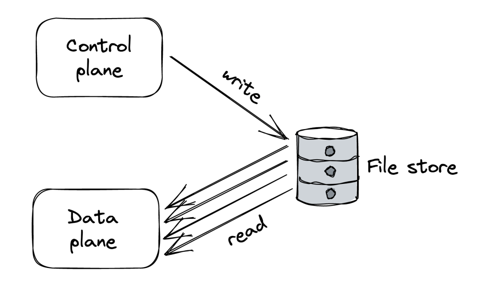

This approach shields the control plane from read load & allows the data plane to continue functioning even if the control plane is down.
This comes at the cost of higher latency and weaker consistency since propagating changes from control plane to data plane increases.

To decrease propagation latency, we can fallback to our original approach but this time, the control plane propagates configuration changes to the data plane.

This way, the control plane can control its pace. 

An optimization one can use is for the control plane to only push the changes from one configuration version to another to avoid sending too much data in cases where the configuration is too big.

The downside is that the data plane will still need to read the initial configuration on startup.
To mitigate this, the intermediary data store can still be used for that purpose:
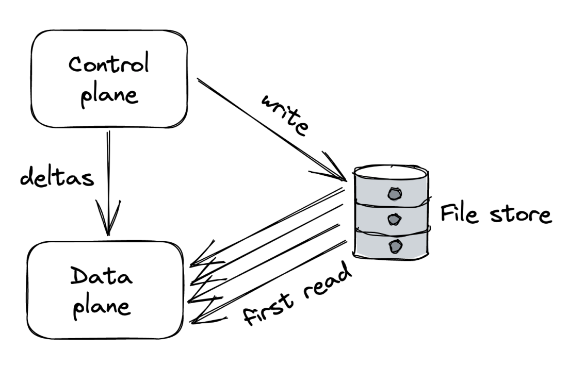

## Control theory
Control theory is an alternative way to think about control & data planes.

The idea is to have a controller which monitors a system & applies a corrective action if there's anything odd - eg desired state differs from actual one.

Whenever you have monitor, compare and action, you have a closed loop - a feedback system.
The most commonly missing part in similar systems is the monitoring.

Example - chain replication. The control plane doesn't just push configuration to the nodes. It monitors their state & executes corrective actions such as removing a node from the chain.

Example - CI/CD pipeline which deploys a new version of a service. A naive implementation is to apply the changes & hope they work.
A more sophisticated system would perform gradual roll out, which rolls back the update in the event the new version leads to an unhealthy system.

In sum, When dealing with a control plane, one should ask themselves - what's missing to close the loop?

# Messaging
Example use-case:
 * API Gateway endpoint for uploading a video & submitting it for processing by an encoding service
 * Naive approach - upload to S3 & call encoding service directly. 
   * What if service is down? What to do with ongoing request?
   * If we fire-ang-forget, but encoding service fails during processing, how do we recover from that failure?
 * Better approach - upload to S3 & notify encoding service via messaging. That guarantees it will eventually receive the request.

How does it work?
 * A message channel acts as temporary buffer between sender & receiver.
 * Sending a message is asynchronous. It doesn't require the receiver to be online at creation time.
 * A message has a well-defined format, consisting of a header and payload (eg JSON).
 * The message can be a command, meant for processing by a worker or an event, notifying services of an interesting event.

Services can use inbound and outbound adapters to send/receive messages from a channel:
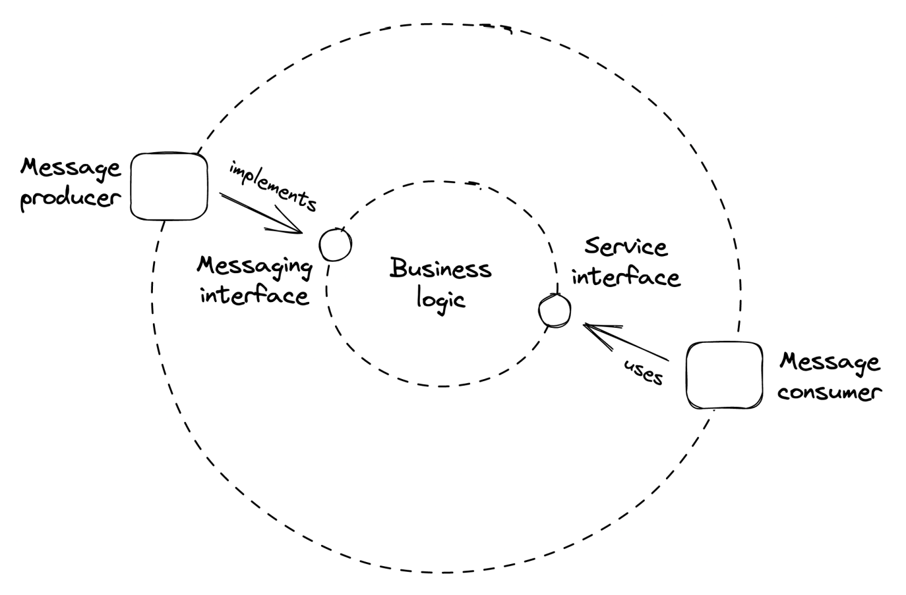

The API Gateway submits a message to the channel & responds to client with `202 Accepted` and a link to uploaded file.
If encoding service fails during processing, the request will be re-sent to another instance of the encoding service.

There are a lot of benefits from decoupling the producer (API Gateway) from the consumer (encoding service):
 * Producer can send messages even if consumer is temporarily unavailable
 * Requests can be load-balanced across a pool of consumer instances, contributing to easy scaling.
 * Consumer can read from message channel at its own pace, smoothing out load spikes.
 * Messages can be batched - eg a client can submit a single read request for last N messages, optimizing throughput.

Message channels can be several kinds:
 * Point-to-point - message is delivered to exactly one consumer.
 * Publish-subscribe - message is delivered to multiple consumers simultaneously.

Downside of message channel is the introduced complexity - additional service to process and an untypical flow of control.

### One-way messaging
Also referred to as point-to-point, in this style a message is received & processed by one consumer only.
Useful for implementing job processing workflows.

### Request-response messaging
Similar to direct request-response style but messages flow through channels.
Useful for implementing traditional request-response communication by piggybacking on message channel's reception guarantee.

In this case, every request has a corresponding response channel and a `response_id`. Producers use this `response_id` to associate it to the origin request.

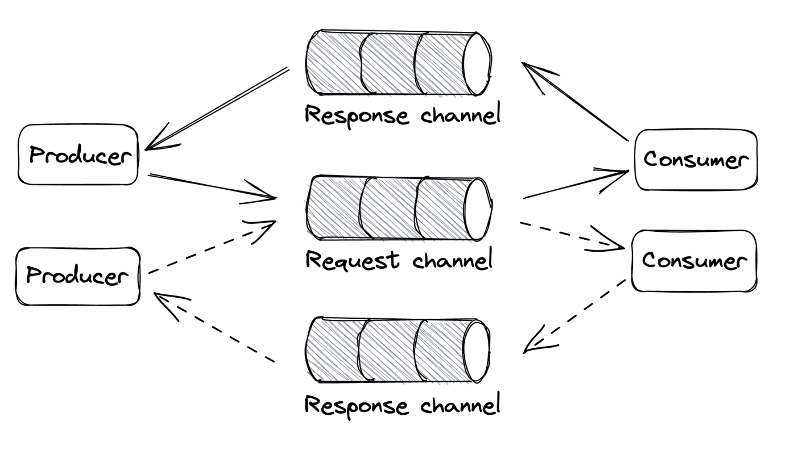

### Broadcast messaging
The producer writes a message to a publish-subscribe channel to broadcast it to all consumers.
Used for a process to notify other services of an interesting event without being aware of them or dealing with them receiving the notification.

## Guarantees
Message channels are implemented by a messaging service/broker such as Amazon SQS or Kafka.

Different message brokers offer different guarantees.

An example trade-off message brokers make is choosing to respect the insertion order of messages.
Making this guarantee trumps horizontal scaling which is crucial for this service as it needs to handle vast amount of load.

When multiple nodes are involved, guaranteeing order involves some form of coordination.

For example, Kafka partitions messages into multiple nodes. To guarantee message ordering, only a single consumer process is allowed to read from a partition.

There are other trade-offs a message broker has to choose from:
 * delivery guarantees - at-most-once or at-least-once
 * message durability
 * latency
 * messaging standards, eg AMQP
 * support for competing consumer instances
 * broker limits, eg max size of messages

For the sake of simplicity, the rest of the sections assume the following guarantees:
 * Channels are point-to-point & support many producer/consumer instances
 * Messages are delivered at-least-once
 * While a consumer is processing a message, other consumers can't process it. Once a `visibility` timeout occurs, it will be distributed to a different consumer.

## Exactly-once processing
A consumer has to delete a message from the channel once it's done processing it.

Regardless of the approach it takes, there's always a possibility of failure:
 * If message is deleted before processing, processing could fail & message is lost
 * If message is deleted after processing, deletion can fail, leading to duplicate processing of the same message

There is no such thing as exactly-once processing. To workaround this, consumers can require messages to be idempotent and deleting them after processing is complete.

## Failures
When a consumer fails to process a message, the visibility timeout occurs & the message is distributed to another consumer.

What if message processing consistently fails?
To limit the blast radius of poisonous messages, we can add a max retry count & move the message to a "dead-letter queue" channel.

Messages that consistently fail will not be lost & they can later be addressed manually by an operator.

## Backlogs
Message channels make a system more robust to outages, because a producer can continue writing to a channel while a consumer is down.
This is fine as long as the arrival rate is less than or equal to the deletion rate.

However, when a consumer can't keep up with a producer, a backlog builds up. The bigger the backlog, the longer it takes to drain it.

Why do backlogs occur?
 * Producer throughput increases due to eg more instances coming online.
 * The consumer's performance has degraded
 * Some messages constantly fail & clog the consumer who spends processing time exclusively on them.

To monitor backlogs, consumers can compare the arrival time of a message with its creation time.

There can be some differences due to physical clocks involved, but the accuracy is usually sufficient.

## Fault isolation
If there's some producer which constantly emits poisonous messages, a consumer can choose to deprioritize those into a lower-priority queue - once read, consumer removes them from the queue & submits them into a separate lower-priority queue.

The consumer still reads from the slow channel but less frequently in order to avoid those messages from clogging the entire system.

The slow messages can be detected based on some identifier such as a `user_id` of a troublesome user.

# Summary
Building scalable applications boils down to:
 * breaking down applications to separate services with their own responsibilities. (functional decomposition)
 * Splitting data into partitions & distributing them across different nodes (partitioning)
 * Replicating functionality or data across nodes (replication)

One subtle message which was conveyed so far - there is a pletora of managed services, which enable you to build a lot of applications.
Their main appeal is that others need to guarantee their availability/throughput/latency, rather than your team.

Typical cloud services to be aware of:
 * Way to run instances in the cloud (eg. AWS EC2)
 * Load-balancing traffic to them (eg. AWS ELB)
 * Distributed file store (eg AWS S3)
 * Key-value document store (eg DynamoDB)
 * Messaging service (eg Kafka, Amazon SQS)

These services enable you to build most kinds of applications you'll need. 
Once you have a stable core, you can optimize by using caching via managed Redis/Memcached/CDN.
