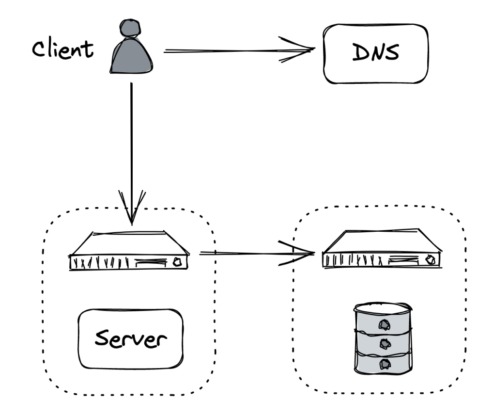

# Scalability
Over the last decades, the number of people with internet access has risen.
This has lead to the need for businesses to handle millions of concurrent users.

To scale, an application must run without performance degradation. The only long-term solution is to scale horizontally.

This part focuses on scaling a small CRUD application:
 * REST API
 * SPA JavaScript front-end
 * Images are stored locally on the server
 * Both database & application server are hosted on the same machine - AWS EC2
 * Public IP Address is managed by a DNS service - AWS Route53

Problems:
 * Not scalable
 * Not fault-tolerant

Naive approach to scaling - scale up by adding more CPU, RAM, Disk, etc.

Better alternative is to scale out - eg move the database to a dedicated server.

This increases the capacity of both the server and the database. 
This technique is called **functional decomposition** - application is broken down to independent components with distinct responsibilities.

Other approaches to scaling:
 * Partitioning - splitting data into partitions & distributing it among nodes.
 * Replication - replicating data or functionality across nodes.

The following sections explore different techniques to scale.

## HTTP Caching
Cruder handles static & dynamic resources:
 * Static resources don't change often - HTML, CSS, JS files
 * Dynamic resources can change - eg a user's profile JSON

Static resources can be cached since they don't change often.
A client (ie browser) can cache the resource so that subsequent access doesn't make network calls to the server.

We can leverage HTTP Caching, which is limited to GET and HEAD HTTP methods.

The server issues a `Cache-Control` header which tells the browser how to handle the resource:

The max-age is the TTL of the resource and the ETag is the version identifier. 
The age is maintained by the cache & indicates for how long has the resource been cached.

If a subsequent request for the resource is received, the resource is served from the cache as long as it is still fresh - TTL hasn't expired.
If, however, the resource has changed on the server in the meantime, clients won't get the latest version immediately.

Reads, therefore, are not strongly consistent.

If a resource has expired, the cache will forward a request to the server asking if it's change. If it's not, it updated its TTL:

One technique we can use is treating static resources as immutable.
Whenever a resource changes, we don't update it. Instead, we publish a new file (\w version tag) & update references to it.

This has the advantage of atomically changing all static resources with the same version.

Put another way, with HTTP caching, we're treating the read path differently from the write path because reads are way more common than writes.
This is referred to as the Command-Query Responsibility Segregation (CQRS) pattern.

### Reverse Proxies
An alternative is to cache static resources on the server-side using reverse proxies.

A reverse proxy is a server-side proxy which intercepts all client calls. It is indistinguishable from the actual server, therefore clients are unaware of its presence.

A common use-case for reverse proxies is to cache static resources returned by the server. 
Since this cache is shared among clients, it will reduce the application server's burden.

Other use-cases for reverse proxies:
 * Authenticate requests on behalf of the server.
 * Compress a response before forwarding it to clients to speed up transmission speed.
 * Rate-limit requests coming from specific IPs or users to protect the server from DDoS attacks.
 * Load-balance requests among multiple servers to handle more load.

NG-INX and HAProxy are popular implementations which are commonly used.
However, caching static resources is commoditized by managed services such as Content delivery networks (CDNs) so we can just leverage those.

## Content delivery networks
