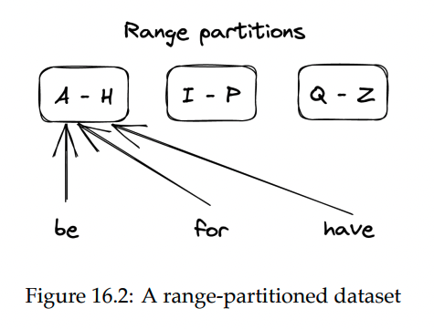
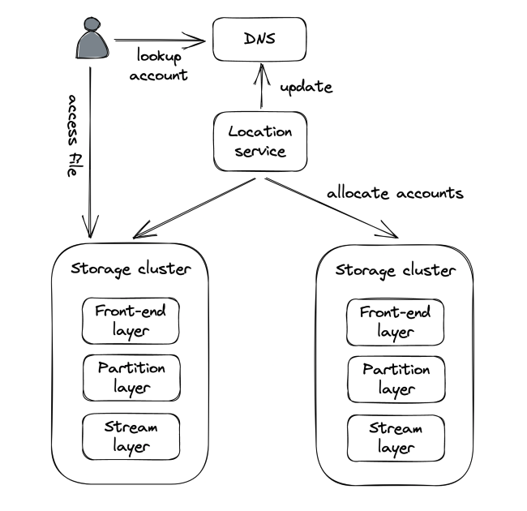
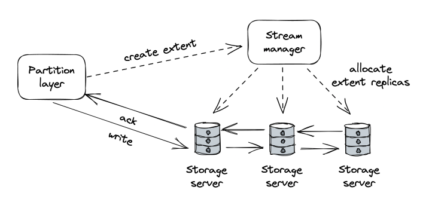

# Scalability
Over the last decades, the number of people with internet access has risen.
This has lead to the need for businesses to handle millions of concurrent users.

To scale, an application must run without performance degradation. The only long-term solution is to scale horizontally.

This part focuses on scaling a small CRUD application:
 * REST API
 * SPA JavaScript front-end
 * Images are stored locally on the server
 * Both database & application server are hosted on the same machine - AWS EC2
 * Public IP Address is managed by a DNS service - AWS Route53

Problems:
 * Not scalable
 * Not fault-tolerant

Naive approach to scaling - scale up by adding more CPU, RAM, Disk, etc.

Better alternative is to scale out - eg move the database to a dedicated server.

This increases the capacity of both the server and the database. 
This technique is called **functional decomposition** - application is broken down to independent components with distinct responsibilities.

Other approaches to scaling:
 * Partitioning - splitting data into partitions & distributing it among nodes.
 * Replication - replicating data or functionality across nodes.

The following sections explore different techniques to scale.

## HTTP Caching
Cruder handles static & dynamic resources:
 * Static resources don't change often - HTML, CSS, JS files
 * Dynamic resources can change - eg a user's profile JSON

Static resources can be cached since they don't change often.
A client (ie browser) can cache the resource so that subsequent access doesn't make network calls to the server.

We can leverage HTTP Caching, which is limited to GET and HEAD HTTP methods.

The server issues a `Cache-Control` header which tells the browser how to handle the resource:

The max-age is the TTL of the resource and the ETag is the version identifier. 
The age is maintained by the cache & indicates for how long has the resource been cached.

If a subsequent request for the resource is received, the resource is served from the cache as long as it is still fresh - TTL hasn't expired.
If, however, the resource has changed on the server in the meantime, clients won't get the latest version immediately.

Reads, therefore, are not strongly consistent.

If a resource has expired, the cache will forward a request to the server asking if it's change. If it's not, it updated its TTL:

One technique we can use is treating static resources as immutable.
Whenever a resource changes, we don't update it. Instead, we publish a new file (\w version tag) & update references to it.

This has the advantage of atomically changing all static resources with the same version.

Put another way, with HTTP caching, we're treating the read path differently from the write path because reads are way more common than writes.
This is referred to as the Command-Query Responsibility Segregation (CQRS) pattern.

### Reverse Proxies
An alternative is to cache static resources on the server-side using reverse proxies.

A reverse proxy is a server-side proxy which intercepts all client calls. It is indistinguishable from the actual server, therefore clients are unaware of its presence.

A common use-case for reverse proxies is to cache static resources returned by the server. 
Since this cache is shared among clients, it will reduce the application server's burden.

Other use-cases for reverse proxies:
 * Authenticate requests on behalf of the server.
 * Compress a response before forwarding it to clients to speed up transmission speed.
 * Rate-limit requests coming from specific IPs or users to protect the server from DDoS attacks.
 * Load-balance requests among multiple servers to handle more load.

NG-INX and HAProxy are popular implementations which are commonly used.
However, caching static resources is commoditized by managed services such as Content delivery networks (CDNs) so we can just leverage those.

## Content delivery networks
CDN - overlay network of geographically distributed caches (reverse proxies), designed to workaround the network protocol.

When you use CDN, clients hit URLs that resolve to the CDN's servers. If a requested resource is stored in there, it is given to clients. If not, the CDN transparently fetches it from the origin server.

Well-known CDNs - Amazon CloudFront and Akamai.

### Overlay network
The main benefit of CDNs is not caching. It's main benefit is the underlying network architecture.

The internet's routing protocol - BGP, is not designed with performance in mind. 
When choosing routes for a package, it takes into consideration number of hops instead of latency or congestion.

CDNs are built on top of the internet, but exploit techniques to reduce response time & increase bandwidth.

It's important to minimize distance between server and client in order to reduce latency. Also, long distances are more error prone.

This is why clients communicate with the CDN server closest to them. 
One way to achieve that is via DNS load balancing - a DNS extension which infers a client's location based on its IP and returns a list of geographically closest servers.

CDNs are also placed at internet exchange points - network nodes where ISPs intersect. This enables them to short-circuit communication between client and server via advanced routing algorithms.
These algorithms take into consideration latency & congestion based on constantly updated data about network health, maintained by the CDN providers.
In addition to that, TCP optimizations are leveraged - eg pooling TCP connections on critical paths to avoid setting up new connections every time.

Apart from caching, CDNs can be leveraged for transporting dynamic resources from client to server for its network transport efficiency.
This way, the CDN effectively becomes the application's frontend, shielding servers from DDoS attacks.

### Caching
CDNs have multiple caching layers. The top one is at edge servers, deployed across different geographical regions.

Infrequently accessed content might not be available in edge servers, hence, it needs to be fetched from the origin using the overlay network for efficiency.

There is a trade-off though - more edge servers can reach more clients, but reduce the cache hit ratio. 
Why? More servers means you'll need to "cache hit" a content in more locations, increasing origin server load.

To mitigate this, there are intermediary caching layers, deployed in fewer geographical regions. Edge servers first fetch content from there, before going to the origin server.

Finally, CDNs are partitioned - there is no single server which holds all the data as that's infeasible. It is dispersed across multiple servers and there's an internal mechanism which routes requests to the appropriate server, which contains the target resource.

## Partitioning
When an application's data grows, at some point it won't fit in a single server. 
That's when partitioning can come in handy - splitting data (shards) across different servers.

An additional benefit is that the application's load capacity increases since load is dispersed across multiple servers vs. a single one.

When a client makes a request to a partitioned system, it needs to know where to route the request.
Usually, a gateway service (reverse proxy) is in charge of this. Mapping of partitions to servers is usually maintained in a fault-tolerant coordination service such as zookeeper or etcd.

Partitioning, unfortunately, introduces a fair amount of complexity:
 * Gateway service is required to route requests to the right nodes.
 * Data might need to be pulled from multiple partitions & aggregated (eg joins across partitions)
 * Transactions are needed to atomically update data across multiple partitions, which limits scalability.
 * If a partition is much more frequently accessed than others, it becomes a bottleneck, limiting scalability.
 * Adding/removing partitions at runtime is challenging because it involves reorganizing data.

Caches are ripe for partitioning as they:
 * don't need to atomically update data across partitions
 * don't need to join data across partitions as caches usually store key-value pairs
 * losing data due to changes in partition configuration is not critical as caches are not the source of truth
 
In terms of implementation, data is distributed using two main mechanisms - hash and range partitioning.
An important prerequisite for partitioning is for the number of possible keys be very large. Eg a boolean key is not appropriate for partitioning.

### Range partitioning
With this mechanism, data is split in lexicographically sorted partitions:

To make range scanning easier, data within a partition is kept in sorted order on disk.

Challenges:
 * How to split partitions? - evenly distributing keys doesn't make sense in eg the english alphabet due to some letters being used more often. This leads to unbalanced partitions.
 * Hotspots - if you eg partition by date & most requests are for data in the current day, those requests will always hit the same partition. Workaround - add a random prefix at the cost of increased complexity.

When data increases or shrinks, the partitions need to be rebalanced - nodes need to be added or removed.
This has to happen in a way which minimizes disruption - minimizing data movement around nodes due to the rebalancing.

Solutions:
 * Static partitioning - define a lot of partitions initially & nodes serve multiple partitions vs. a single one.
    * drawback 1 - partition size is fixed
    * drawback 2 - trade-off between lots of partitions & too few. Too many -> decreased performance. Too few -> limit scalability.
 * Dynamic partitioning - system starts with a single partition & is rebalanced into sub-partitions over time. 
    * If data grows, partition is split into two sub-partitions. 
    * If data shrinks, sub-partitions are removed & data is merged.

### Hash partitioning
Use a hash function which deterministically maps a key to a seemingly random number, which is assigned to a partition.
Hash functions usually distribute keys uniformly.

Challenge - assigning hashes to partitions.
 * Naive approach - use the module operator. Problem - rebalancing means moving almost all the data around.
 * Better approach - consistent hashing.

How consistent hashing works:
 * partitions and keys are randomly distributed in a circle.
 * Each key is assigned to the closest partition which appears in the circle in clockwise order.

Adding a new partition only rebalances the keys which are now assigned to it in the circle:

Main drawback of hash partitioning - sorted order is lost. This can be mitigated by sorting data within a partition based on a secondary key.

## File storage
Using CDNs enables our files to be quickly accessible by clients. However, our server will run out of disk space as the number of files we need to store increases.

To work around this limit, we can use a managed file store such as AWS S3 or Azure Blob Storage.

Managed file stores scalable, highly available & offer strong durability guarantees.
In addition to that, managed file stores enable anyone with access to its URL to point to it, meaning we can point our CDNs to the file store directly.

### Blob storage architecture
This section explores how distributed blob stores work under the hood by exploring the architecture of Azure Storage.

Side note - AS works with files, tables and queues, but discussion is only focused on the file (blob) store.

AS Architecture in a nutshell:
 * Composed of different racks of clusters, which are geographically distributed. Each node in a cluster has separate network & (redundant) power supply.
 * file URL are composed of account name + file name - https://{account_name}.blob.core.windows.net/{filename}
 * Customer sets up account name & AS DNS uses that to identify the storage cluster where the data is located. The filename is used to detect the correct node within the cluster.
 * A location service acts as a control plane, which creates accounts & allocates them to clusters.
   * Creating a new account leads to the location service 1) choosing an appropriate cluster, 2) updating the cluster configuration to accept requests for that account name and 3) updates the DNS records 
 * The storage cluster itself is composed of a front-end, partition and stream layers.

The Stream layer implements a distributed append-only file system in which the data is stored in "streams". A stream is represented as a sequence of "extents", which are replicated using [chain replication](https://github.com/preslavmihaylov/booknotes/tree/master/system-design/understanding-distributed-systems/part02#chain-replication).
A stream manager acts as the control plane within the stream layer - it 1) allocates extents to the list of chained servers and 2) handles faults such as missing extent replicas.

Partition layer is the abstraction where high-level file operations are translated to low-level stream operations.

The partition layer also has a dedicated control plane, called the partition manager. It maintains an index of all files within the cluster.
The partition manager range-partitions the index into separate partition servers. It also load-balances partitions across servers by splitting/merging them as necessary.
The partition manager also replicates accounts across clusters for the purposes of migration in the event of disaster and for load-balancing purposes.

Finally, the front-end layer is a stateless reverse proxy which authenticates requests and routes them to appropriate partitions.

Side note - AS was strongly consisten from the get-go, while AWS S3 started offering strong consistency in 2021.

## Network load balancing
